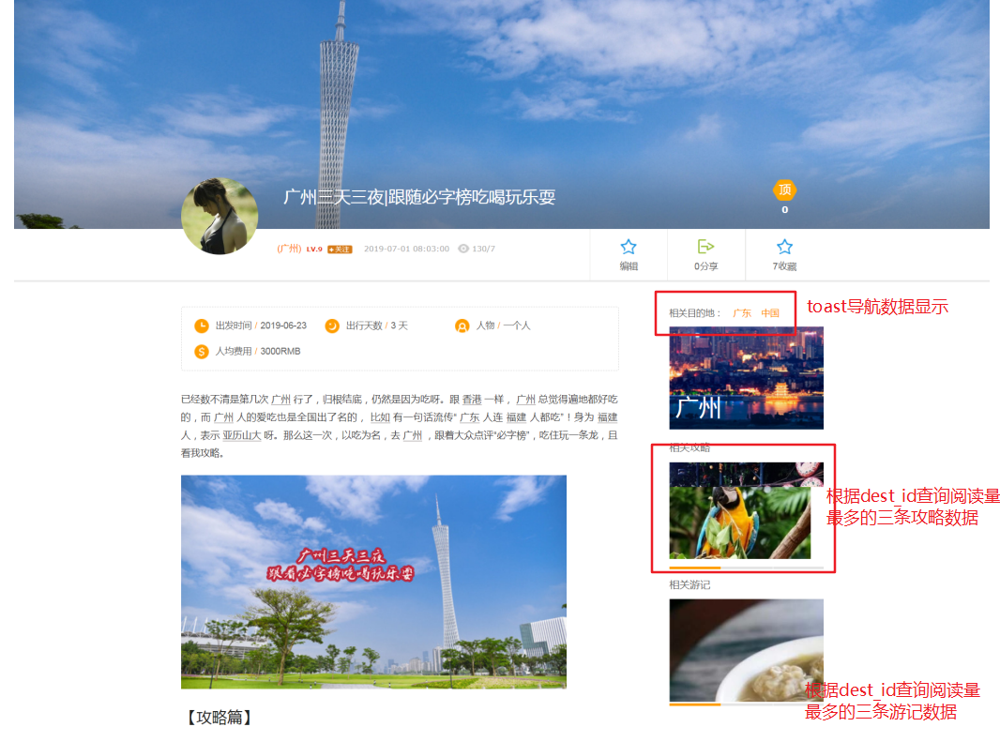
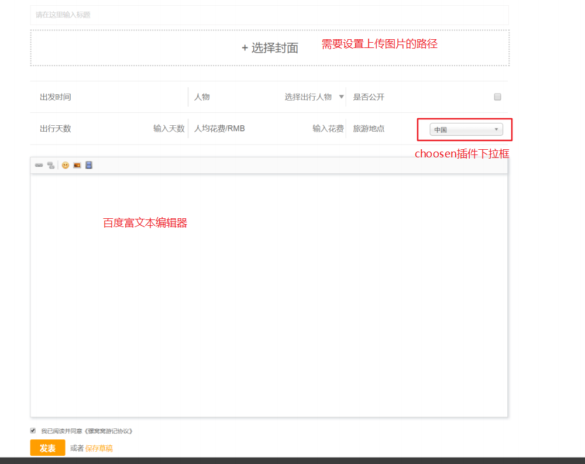
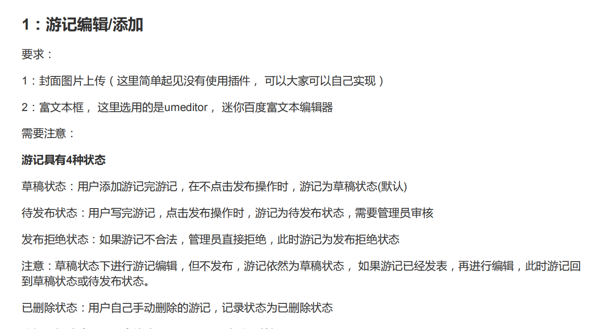

### 游记明细显示
需求分析:


明细页面显示数据:
```java
界面显示数据:
|-- detail 明细数据,关联查询游记富文本内容
|-- 关联目的地 (toast)
  |-- 只显示中国广东，需要移除广州
  |-- 图片使用detail的封面url
|-- 关联阅读量前三的相关攻略
  |-- 根据目的地的id去查询
|-- 相关阅读量前三的游记
  |-- 根据目的地的id去查询,阅读量排序
```

<br>
---

### 写游记
需求分析:



```
 定义input方法用于数据回显
    |-- tv: 数据的回显(游记内容)
    |-- dests:查询目的地下拉列表数据

文件上传(coverImageUpload)定义一个上传文件的方法
    |-- 文件路径可以在properties中进行配置
    |-- 定义一个FileUtil将文件保存到配置的路径

百度编辑器UEditorMINI:
    |-- 导入UMEditorUploader.java类
        |-- 引用包都是apache.common
    |-- contentImage文件上出处理方法
        |-- umeditor.config中配置了相关映射

多选下拉框（chosen）

保存操作
  |-- 发表:待审核状态  保存草稿:草稿状态
  |-- 需要手动保存的数据
      |-- author : controller方法参数注入
      |-- 文章摘要
          |-- 截取前200个字符串作为文章摘要
          |-- 审核时，由运营人员总结概况
      |-- 创建时间(在创建时才设置)
      |-- 最后更新时间
      |-- 游记的文本内容
  |-- 保存成功之后返回保存记录的id 数据(用于返回明细界面回显数据)

细节:
* 只有发布状态的列表才能查看(在query中设置state参数u)
* 点击编辑操作，需要当前登陆的id和游记的作者一致才显示编辑按钮
```


<br>
---
