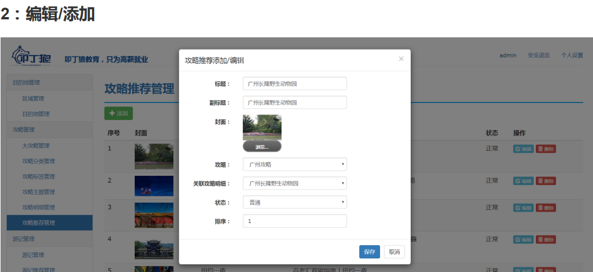

## 攻略推荐列表
需求: 攻略推荐， 指需要在前端网站首页/攻略首页显示的攻略文章，后续配合爆款攻略营销而设计模块。


### 攻略推荐实体类
```java
//-----攻略推荐----------
@Setter
@Getter
public class StrategyCommend extends BaseDomain {
    public static final int STATE_NORMAL = 0;   //正常
    public static final int STATE_DISABLE = 1;  //禁用

    private Long strategyId; //攻略id
    private String title;  //标题
    private String subTitle; //副标题
    private String coverUrl; //封面
    private int state = STATE_NORMAL;  //状态
    private int sequence;  //排序

    public String getStateDisplay(){
        return state == STATE_NORMAL?"正常":"禁用";
    }
}
```

### 后端
* 攻略推荐编辑保存
  * |-- 查询攻略明细作为下拉框数据




### 前端:
* 需求:根据状态和排序查询推荐攻略


步骤:
* StrategyController添加index方法
  * |-- 根据状态和序号查询前5条数据
  * |-- 点击跳转详情页面


<br>
---
