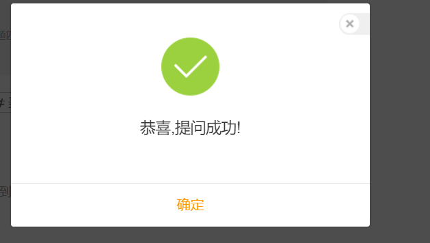

我要提问页面
问答列表页面
问答详情页面

## 我要提问页面

问题标题
* |-- 问题详细内容 : 富文本内容
* |-- 选择目的地 : 使用多选下拉框
* |-- 兴趣标签 : 问题的兴趣标签
    * |-- 兴趣标签 是一个问题的类型，它有助于为你的问题匹配擅长该类问题的蜂蜂回答
* |-- 匿名提问 : 问题上不会显示真实用户信息

收到答案时短信通知我 (有空再做)

* |-- 保存成功后，需要后台进行审核是否通过

实体设计:
id
关联的用户信息 : authorId
问题标题 : title
问题目的地 : destId
问题标签 : 使用中间表维护
匿名提问字段 : isHidden
浏览数量 : viewnum
评论数 : replynum
创建时间 :
发布时间 :
state : 状态 0禁用 1 待审核 2 发布状态
isHot : 设置是否热门

----- 问答问题详细--------
id
content

标签 : (可以使用数据字典,或是建立一张标签表)

确定之后跳转到详情页面

## 问答页面

问答首页

#### 搜索功能
* 根据标题进行搜索
    |-- 可以使用es保存 问题总数 +  标题数据 + 问题标题 + 问题的回答数

#### 热门问题

需求分析:
1. 显示热门数据 （ishot 字段 + 只有发布状态的才能显示）
2. 数据选项
    |-- 提问的问题标题
    |-- 问题的评论数+发布的时间 + 问题的标签
    |-- 评论的第一条数据： 评论的用户信息 + 封面(从评论内容中截取第一个数据作为封面) + 评论内容

### 最新问题
* 按照问题的发布时间进行查询
显示数据:
  * |-- 用户头像
  * |-- 问题标题 + 问题内容
  * |-- 标签
  * |-- 浏览数 + 点赞数

### 待回答问题
* 查询评论数为0的数据

显示数据:
* |-- 用户头像
* |-- 问题标题 + 问题内容
* |-- 标签
* |-- 浏览数 + 点赞数

## 我的问答
* 我的提问:
    |-- 跳转到我的提问页面  question.html 页面
    |-- 显示我的提问数据
* 我的回答: 跳转到我的回答页面  answer.html 页面
    |-- 显示我的相关回答数据
* 为我推荐的问题
    |-- 推荐回答相关数据

### 问答详情页面  (wenda/detail-7064939.html)

需求:
1. 显示问题相关信息以及回答信息

#### 回答评论列表

实现分析:
* 使用mongodb 实现关于评论列表的实现

评论
id
关联的问答 : answerId
评论人信息
    |-- 用户id  : userid
    |-- 用户姓名 : username
    |-- 等级 : level
    |-- 头像  : headImgUrl
发布时间 : createtime
评论类别 : type
关联的评论--> 做二级评论
    |-- TravelComment refComment
点赞数 : thumbupnum
    |- list<User>
评论内容
    |-- content

public static final int TRAVLE_COMMENT_TYPE_COMMENT = 0; //普通评论
public static final int TRAVLE_COMMENT_TYPE = 1; //评论的评论

private int type = TRAVLE_COMMENT_TYPE_COMMENT; //评论类别
private Date createTime; //创建时间
private String content;  //评论内容
private TravelComment refComment;  //关联的评论

回答实体类设计:
关联问题的id : questionId
回答的封面: coverUrl
用户显示信息
    |-- 用户id  : userid
    |-- 用户姓名 : username
    |-- 等级 : level
    |-- 头像  : headImgUrl
创建时间 : createtime
评论内容 : content
评论数 : replynum
    |-- list<评论的列表>
点赞数 : thumbupnum
    |- list<User>

// --------- 评论列表数据 ----------

QQ空间分享连接 : qzshare

http://www.zixuephp.net/article-309.html

https://www.mafengwo.cn/wenda/detail-11144850.html

/images/mfw-ask/mfwask-2016sprite_v6.png
