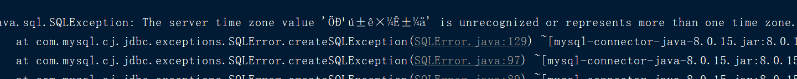
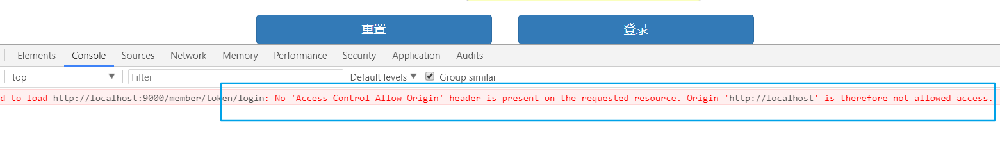
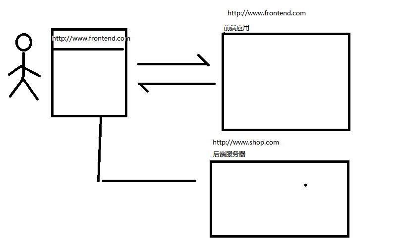
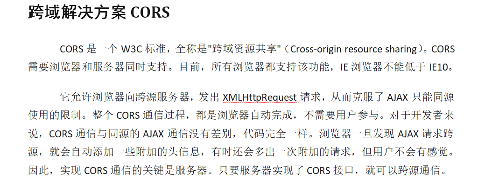
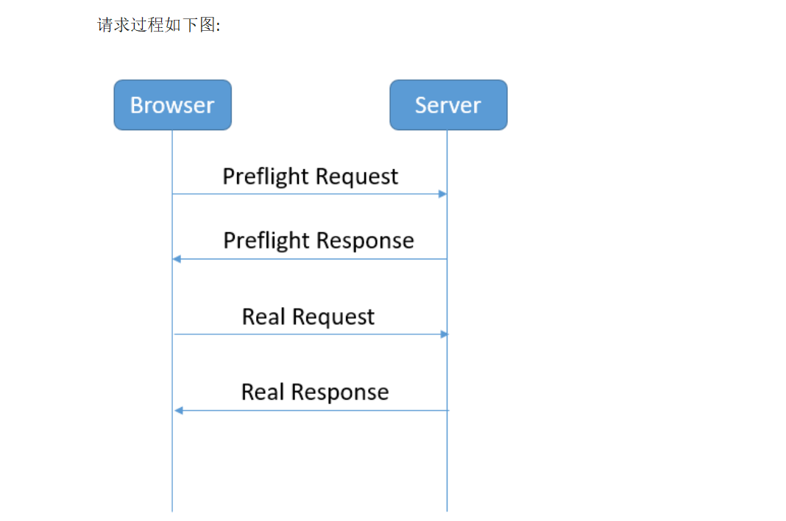
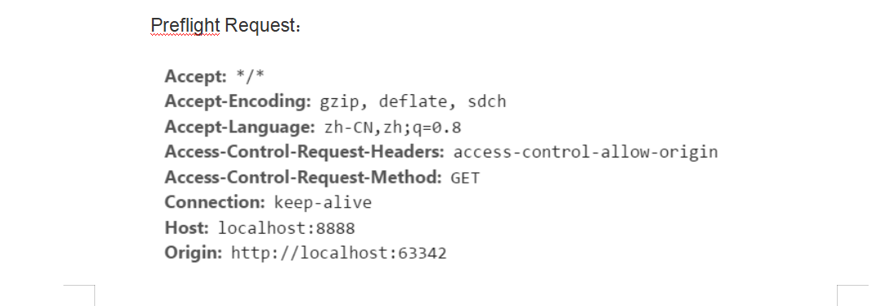
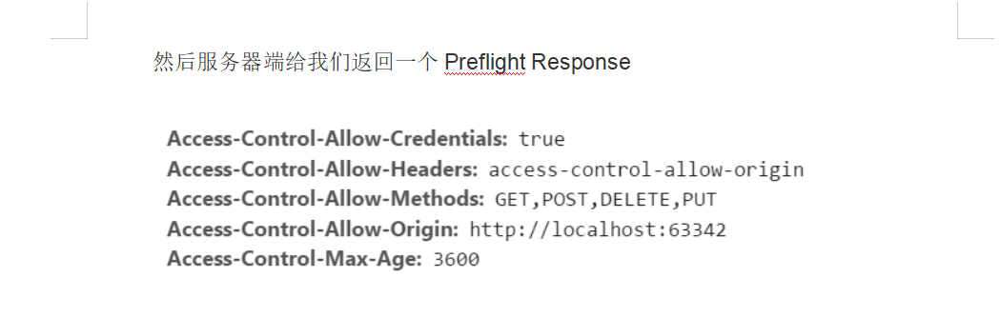
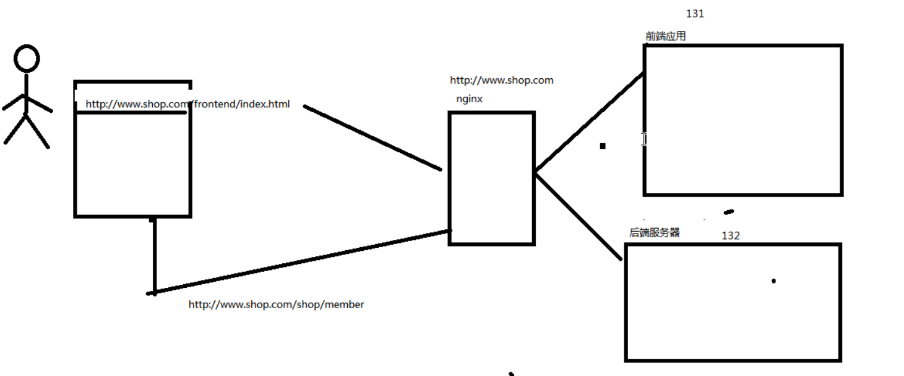
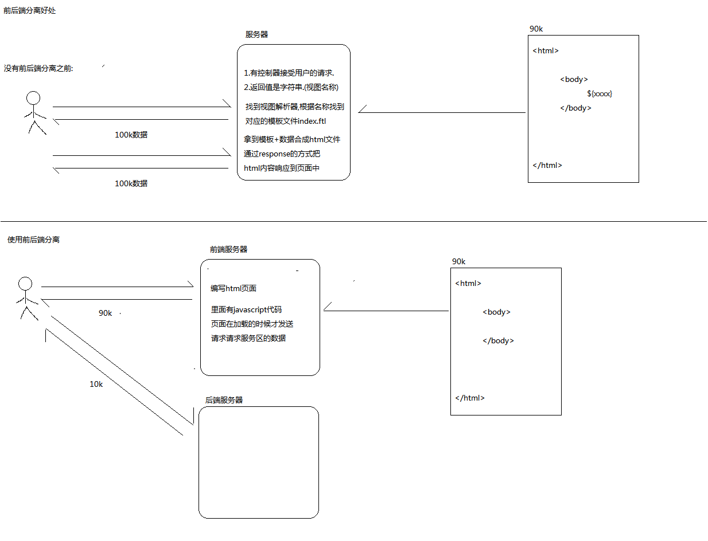

### 系统架构分析

```
## 存放前端网页数据
front-end-server[jar]
## 后端项目
shop-parent[POM]
    |-- shop-common[jar]
    |-- redis-spring-boot-starter[jar]
    |-- eureka-server[jar]
    |-- config-server[jar]
    |-- zuul-server[jar]
    |-- shop-provider[pom]
        |-- member-server[jar]
        |-- good-server[jar]
        |-- seckill-server[jar]
    |-- shop-provider-api[pom]
        |-- member-api[jar]
        |-- good-api[jar]
        |-- seckill-api[jar]
## 处理前端请求
websocket-server[jar]
```

### 项目搭建
使用maven项目创建
1. 创建shop-parent项目,添加springboot
2. 创建shop-comon,删除test
3. 创建eureka-server,集成eureka
4. 创建config-server
      |-- 依赖注册中心eruka客户端 + config 依赖
      |-- 创建yml,添加相关配置
      |-- 添加启动类，配置注解
      |-- 在码云上创建项目
      |-- 测试: 访问git上的 http://localhost:9100/zuul-server.yml
5. 创建zuul-server
      |-- 添加依赖 : eureka-client + netflix-zuul +config-server
      |-- 创建bootstrap.yml
      |-- name : 代表可以读取多个配置文件
      |-- 网关启动类
6. 创建shop-provide,shop-provide-api
      |-- pom 打包类型,删除src
7. 在shop-provide-api下创建member-api
    |-- shop-provide-api 依赖 common
8. 在shop-provide下创建member-server
    |-- shop-provide 可选依赖 member-api(管理版本)
    |-- shop-provide 可选依赖 Druid + mybatis + mysql
    |-- 配置中心中添加member-server.yml
    |-- 配置Druid 和 Mybatis
9. 创建member数据库-->存放用户表
10. shop-provide 添加 web+eruka-client+config-client依赖
11. shop-provide-api下添加ribbon+openfeign+hystrix
      |-- 服务方和消费端都需要依赖,所以添加到api
12.  member中 添加bootstrap.yml +  MemberServerApp
        |-- 添加 User 类
        |-- 添加 UserMapper + UserService
        |-- 添加 UserController
13. 定义网关的路由规则


### sql 出现异常,需要设置编码



```
解决方法：
1.在原来的参数“url”后面，拼上这个字符串：?serverTimezone=GMT%2B8，
　　　　如：jdbc:mysql://localhost:3306/test?serverTimezone=GMT%2B8

　　　　　　东八区的表示：
　　　　　　　　GMT%2B8，即GMT+8，北京时间东八区
　　　　　　　　Asia/Shangha，上海时间
　　　　　　为何没有asia/beijing时区？

2.设置mysql的时区
　　　　MySQL默认的时区是UTC时区
（1）永久的修改：修改mysql的配置文件，添加：default-time-zone='+08:00'，重启mysql生效
（2）临时的修改：执行mysql命令 set global time_zone='+08:00'，立即生效，重启mysql后失效
```

### 前端项目搭建
创建前端项目:
1. 使用springboot创建frontend-server,需要添加springboot-web
2. 将静态资源保存到项目中static目录


### 用户密码加密
问题: 使用明文登陆容易造成密码信息被拦截，不安全
解决方案:
1. 使用俩次密文加密,
    * 在前端进行加密，使用salt + md5 加密 ,防止传输过程中密码泄露
    * 在后端进行加密, 使用salt + md5 加密 ,防止前端传递的密码的密文是相同的,需要再次加密
2. 使用https 传输过程信息是加密的


#### 俩次密文加密:
1. 在member-server中添加commons-codec依赖

```xml
<!--用户加密的依赖-->
<dependency>
   <groupId>commons-codec</groupId>
   <artifactId>commons-codec</artifactId>
</dependency>
```
2. 定义一个MD5Util,模拟前端密文加密和后端密文加密

```java
public class MD5Util{

  public class MD5Util {
      // 用盐进行干扰
      public static final String salt="1a2b3c4d";

      // 模拟前端加密过程
      public static String inputToFormPass(String password){
          return DigestUtils.md5DigestAsHex((salt.charAt(0) + salt.charAt(2) +password+ salt.charAt(4) + salt.charAt(6) + "").getBytes());
      }

      //拿到前端传过来的密文，对密文进行加盐加密-->密文
      public static String formPassToDbPass(String password,String salt){
          return DigestUtils.md5DigestAsHex((salt.charAt(0) + salt.charAt(1) +password+ salt.charAt(2) + salt.charAt(3) + "").getBytes());
      }

      public static void main(String[] args) {
          String input="123456";
          String formPass = inputToFormPass(input);
          // 定义盐
          String salt= UUID.randomUUID().toString().replace("-","").substring(0,6);
          System.out.println("salt="+salt);

          String dbPass = formPassToDbPass(formPass, salt);
          System.out.println(dbPass);
      }
  }
}
```

## 前端登陆访问

1. 前端发送请求
2. 后端创建TokenController，LoginVO 接收参数

```js
/* 登陆操作: 对密码先进行加密，发送给后端客户端 */
function doLogin() {
   var mobile=$("#mobile").val();
   var password=$("#password").val();
   var formpass=passsword_salt.charAt(0) + passsword_salt.charAt(2) +password+ passsword_salt.charAt(4) + passsword_salt.charAt(6);
   $.ajax({
       url:"http://localhost:9000/member/token/login",
       type:"POST",
       data:{username:mobile,password:formpass},
       success:function (data) {

       },
       error:function () {
           layer.msg("登陆失败");
       },
       xhrFields: { withCredentials: true } // 拥有cookie的操作权限
   })

}
```

3. jQuery请求的时候需要配置这些信息.

```js
$.support.cors = true;
$.ajax({
            url:"http://localhost:9000/member/api/v1/tokens",
            type:"POST",
            dataType: "json",
            contentType: "application/json;charset=utf-8",
            xhrFields: { withCredentials: true }
});
```

4. 在zuulServerApp 上创建一个CorsFilter，响应预请求时返回相关的header数据

```java
@Bean
public CorsFilter corsFilter() {
    final UrlBasedCorsConfigurationSource source = new UrlBasedCorsConfigurationSource();
    final CorsConfiguration config = new CorsConfiguration();
    // 允许cookies跨域
    config.setAllowCredentials(true);
    // #允许向该服务器提交请求的URI，*表示全部允许，在SpringMVC中，如果设成*，会自动转成当前请求头中的Origin
    config.addAllowedOrigin("*");
    // #允许访问的头信息,*表示全部
    config.addAllowedHeader("*");
    // 预检请求的缓存时间（秒），即在这个时间段里，对于相同的跨域请求不会再预检了
    config.setMaxAge(18000L);
    // 允许提交请求的方法，*表示全部允许
    config.addAllowedMethod("OPTIONS");
    config.addAllowedMethod("HEAD");
    // 允许Get的请求方法
    config.addAllowedMethod("GET");
    config.addAllowedMethod("PUT");
    config.addAllowedMethod("POST");
    config.addAllowedMethod("DELETE");
    config.addAllowedMethod("PATCH");
    source.registerCorsConfiguration("/**", config);
    return new CorsFilter(source);
}
```


## 解决跨域问题

问题描述:
1. 跨域携带不了cookie
2. ajax 不支持跨域访问



解决方案:

#### 使用cros 解决
1. 前端在common.js中，添加
$.support.cors = true;
2. 在发送的请求中添加
xhrFields: { withCredentials: true } // 拥有cookie的操作权限
3. 后端zuulServerApp启动类设置拦截器CorsFilter，响应预请求时返回相关的header数据







#### 使用ngnix解决跨域
1. 使用nginx 挂载前端服务器和后端服务器
2. 根据访问的地址前缀分别分配给前端应用和后端应用
3. 此时发送请求的域名是一样的，可以避免跨域问题




## 前后端分离好处:
1. 业务分离,互不影响
2. 提升性能


#### 没有前后端分离之前:
服务器:
1. 有控制器接收用户的请求
2. 返回值是字符串(视图的名称)
3. 根据modelAndView 找到对应的模板文件 index.ftl
4. 拿到模板+数据合成html文件,通过response的方式把html内容响应到页面中


#### 使用前后端分离:
前端服务器:
1. 编写html页面
2. 页面在加载的时候才发送请求,请求服务器的数据
后端服务器:
多次访问后，只访问后端服务器，访问数据较少，能提升性能


