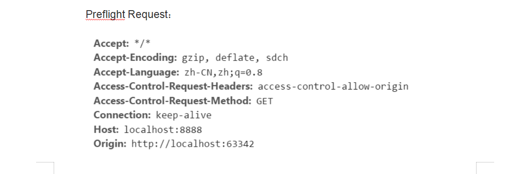
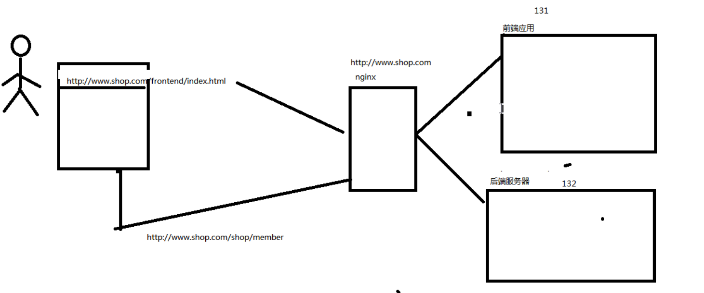

## 解决跨域问题

问题描述:
1. 跨域携带不了cookie
2. ajax 不支持跨域访问

解决方案:

#### 使用cros 解决
1. 前端在common.js中，添加
$.support.cors = true;
2. 在发送的请求中添加
xhrFields: { withCredentials: true } // 拥有cookie的操作权限
3. 后端zuulServerApp启动类设置拦截器CorsFilter，响应预请求时返回相关的header数据

#### 使用ngnix解决跨域
1. 使用nginx 挂载前端服务器和后端服务器
2. 根据访问的地址前缀分别分配给前端应用和后端应用
3. 此时发送请求的域名是一样的，可以避免跨域问题

