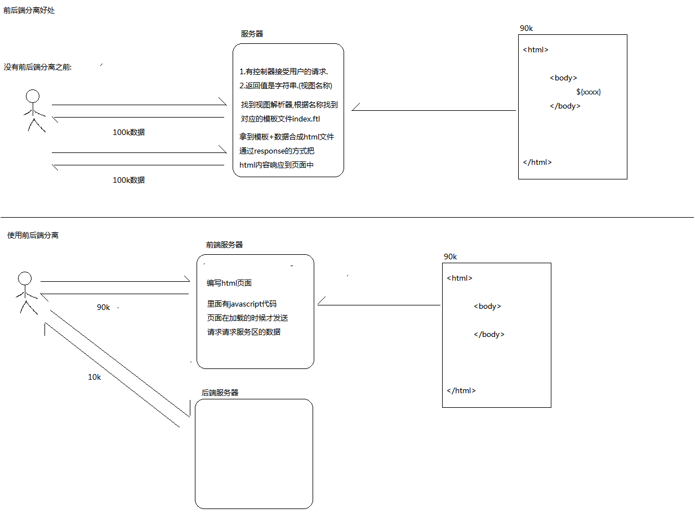

## 前后端分离好处:
1. 业务分离,互不影响
2. 提升性能

#### 没有前后端分离之前:
服务器:
1. 有控制器接收用户的请求
2. 返回值是字符串(视图的名称)
3. 根据modelAndView 找到对应的模板文件 index.ftl
4. 拿到模板+数据合成html文件,通过response的方式把html内容响应到页面中

#### 使用前后端分离:
前端服务器:
1. 编写html页面
2. 页面在加载的时候才发送请求,请求服务器的数据
后端服务器:
多次访问后，只访问后端服务器，访问数据较少，能提升性能

