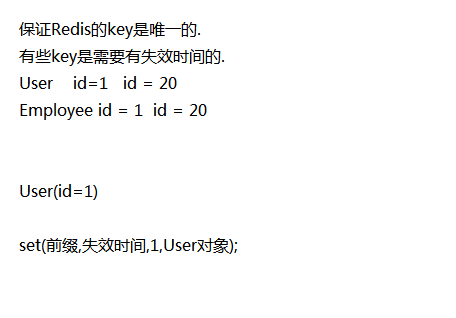

### springboot 原理
1. starter 内部需要做哪些事情
* 当项目引入这个starter,把对应的一些对象先创建号，配置好

自动装配
* 会扫描当前项目下所有的META-INF 下的spring.factories
* 加载自动装配类，读取配置文件信息, 创建相关的bean对象
* 配置文件信息封装在一个配置类中
* 使用时直接引入依赖，注入相关bean对象

## 自定义redis-starter

1. 准备spring.factory
2. 配置自动装配类
3. 需要创建的bean 对象
4. 需要有配置文件

### 操作步骤：
1. 创建一个模块 redis-spring-boot-start

2. 添加依赖 lombok + jredis + jackjson + autoconfigure

3. 创建redis.ReisTemplate 类 (bean 对象),提供redis 相关操作的方法

    |-- set(),get(),exist(),expire(),setex(),hset(),hget()

4. 定义KeyPrefix接口
    |-- getKeyPrefix
    |-- getExpireSeconds

5. 创建 RedisProperties,封装redis 相关配置参数

6. 创建 RedisAutoConfiguration 自动装配类,创建相关的bean对象
    |-- @ConditionalOnClass({JedisPool.class, Jedis.class})// 必须拥有对应的类才加载配置文件
    |-- @EnableConfigurationProperties(RedisProperties.class) // 加载配置文件
    |-- @ConditionalOnProperty(prefix = "redis",name = "host")//配置文件中要有redis.host属性

7. 在resources 创建META-INF中spring.factory 文件

8. 在码云上添加redis.yml,使用时可以直接引入

坐标的命名:
1. 不要以spring-boot开头
2. key 相关处理

