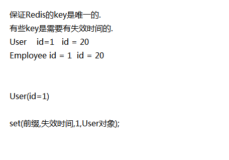
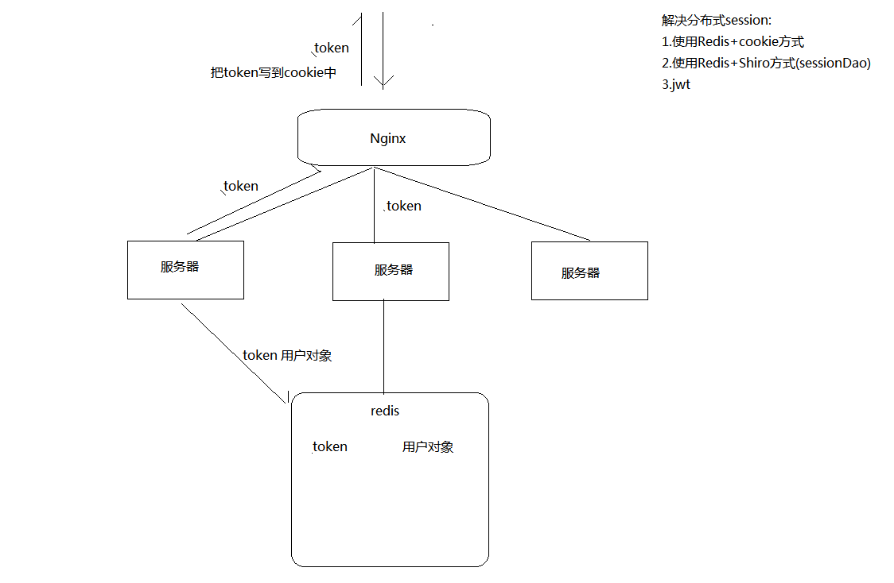

### 定义后端请求返回的数据格式

#### 前端页面

发送异步请求后，获取前端响应的数据进行处理
```html
{code:500101,msg:"操作失败"}
{code:500201,msg:"操作失败"}
{code:200,msg:"操作成功",data:{id:1,username:kiva}}
```

```java
public class Result <T> implements Serializable {

    private static final int SUCCESS_CODE = 200;
    private static final int ERROR_CODE = 500000;
    private static final String SUCCESS_MESSAGE = "操作成功";
    private static final String ERROR_MESSAGE = "系统繁忙，请稍后重试";

    private Integer code; // 用于区分不同服务下的响应码
    private String msg;
    private T data;

    public  static <T> Result success(T data){
        return new Result<>(SUCCESS_CODE,SUCCESS_MESSAGE,data);
    }

    public  static  Result defaultError(){
        return new Result<>(ERROR_CODE,ERROR_MESSAGE,null);
    }

    public  static  Result error(CodeMsg codeMsg){
        return new Result<>(codeMsg.getCode(),codeMsg.getMsg(),null);
    }
}

```

#### 控制层
对业务层抛出的异常进行统一异常处理，获取异常信息封装成Result,响应给前端

```java
public class CommonControllerAdvice {

    @ExceptionHandler(BussinessException.class)
    @ResponseBody
    public Result handlerBussinessException(BussinessException e){
        return Result.error(e.getCodeMsg());
    }

    @ExceptionHandler(Exception.class)
    @ResponseBody
    public Result handlerException(Exception e){
        e.printStackTrace();
        return Result.defaultError();
    }

}

```

#### 业务层
当业务操作失败时，需要将异常信息抛出，使用自定义异常封装code和msg

```java
public class CodeMsg{
  private Integer code;
  private String msg;
  static final CodeMsg login_error=new CodeMsg(500101,"登陆异常");
}

public class BussinessException extends RunTimeException{
  CodeMsg codeMsg;
  public BussinessException(CodeMsg codeMsg){
      this.codeMsg=codeMsg;
  }
}

// 操作失败时抛出异常
throw new BussinessException(CodeMsg.login_error);
```


### 统一异常处理
1. common 中定义Result + CodeMsg
2. member 中定义MemberServerCodeMsg 继承CodeMsg
    |-- 500101 , 登陆异常
    |-- 500102 , 非法操作
    |-- 500103 , 参数不规范:{0}
3. 自定义MemberControllerAdvice  extends CommonControllerAdvice

```java
public class MemberServerCodeMsg extends CodeMsg {

    public MemberServerCodeMsg() {}

    public MemberServerCodeMsg(Integer code, String msg) {
        super(code, msg);
    }
    // 登陆异常
    public static final MemberServerCodeMsg LOGIN_ERROR = new MemberServerCodeMsg(500101,"用户名或密码输入不正确");
    // 操作异常
    public static final MemberServerCodeMsg OP_ERROR = new MemberServerCodeMsg(500102,"非法操作");
    // 参数校验异常
    public static final MemberServerCodeMsg PARAM_ERROR = new MemberServerCodeMsg(500103,"参数不规范:{0}");


    // PARAM_ERROR是静态变量，如果多次调用可能导致占位符会被覆盖，重新创建一个对象填充占位符
    public MemberServerCodeMsg fillArg(Object... args){
        return new MemberServerCodeMsg(this.getCode(),MessageFormat.format(this.getMsg(),args));
    }

}
```

### 登陆功能实现
1. 定义userService.login(loginVo),返回token 给前端
2. 登陆操作进行非空校验，MemberServerCodeMsg 中定义非法操作常量
3. 根据用户名查询用户信息，对客户端密码进行加盐再与数据库中的密码比较
4. 前端登陆成功跳转到good.html

核心代码如下:
```java
//--------userService 中 -----
public String login(LoginQueryObject qo) {
   User user=userMapper.selectByPrimaryKey(qo.getUsername());
   if(user==null){
       throw new BussinessException(MemberServerCodeMsg.LOGIN_ERROR);
   }
   // 进行密码校验
   String inputPwd = MD5Util.formPassToDbPass(qo.getPassword(), user.getSalt());

   if(!inputPwd.equals(user.getPassword())){// 密码不一致
       throw new BussinessException(MemberServerCodeMsg.LOGIN_ERROR);
   }
   return createToken(user);
}
```


## JSR303参数校验
参考网站 : https://jframe.cn/a/7be5952385444041b9b956adf501d007
#### 简介:
JSR303 是一套JavaBean参数校验的标准，它定义了很多常用的校验注解，我们可以直接将这些注解加在我们JavaBean的属性上面，就可以在需要校验的时候进行校验了。

操作步骤:
1. 添加validation依赖
```xml
<dependency>
	<groupId>org.springframework.boot</groupId>
	<artifactId>spring-boot-starter-validation</artifactId>
</dependency>
```
2. 对LoginQueryObject接收参数添加校验注解
    |-- username @Pattern("1\\d{10s}",message:"手机格式格式不正确")
    |-- passsword @NotNull(message:"密码不能为空")
3. controller方法上添加@Valid,校验通过才进入方法
4. 校验不通过，会抛出一个BindException
5. 在MemberServerControllerAdvice 处理BindException
   * |-- 获取异常参数信息，将数据封装到MemberServerCodeMsg中
   * |-- 定义param-error 常量,使用{0}占位符
      * |-- 500103,"参数异常:{0}"
   * |-- 使用异常信息填充占位符 MessageFormat.format(pattern,Object ...args);

相关代码如下:

```java
//-------参数校验封装--------
public class LoginQueryObject implements Serializable {
    @Pattern(regexp = "1\\d{10}",message = "手机格式不正确")
    private String username;
    @NotNull(message = "密码不能为空")
    private String password;
}
```


**异常信息参数封装**
```java
@ControllerAdvice
public class MemberControllerAdvice extends CommonControllerAdvice {
    // 统一处理MemberServer特有的异常.
    @ExceptionHandler(BindException.class)
    @ResponseBody
    public Result handlerBussinessException(BindException e){
        // 获取校验信息,将校验码和校验信息封装到Result中
        String defaultMessage = e.getAllErrors().get(0).getDefaultMessage();
        return Result.error(MemberServerCodeMsg.PARAM_ERROR.fillArg(defaultMessage));
    }
}

//--------异常参数封装---------
public class MemberServerCodeMsg extends CodeMsg {
    ...
    // 参数校验异常
    public static final MemberServerCodeMsg PARAM_ERROR = new MemberServerCodeMsg(500103,"参数不规范:{0}");
    // PARAM_ERROR是静态变量，如果多次调用可能导致占位符会被覆盖，重新创建一个对象填充占位符
    public MemberServerCodeMsg fillArg(Object... args){
      return new MemberServerCodeMsg(this.getCode(),MessageFormat.format(this.getMsg(),args));
    }
}
```


### springboot 原理
1. starter 内部需要做哪些事情
* 当项目引入这个starter,把对应的一些对象先创建号，配置好

自动装配
* 会扫描当前项目下所有的META-INF 下的spring.factories
* 加载自动装配类，读取配置文件信息, 创建相关的bean对象
* 配置文件信息封装在一个配置类中
* 使用时直接引入依赖，注入相关bean对象

## 自定义redis-starter

1. 准备spring.factory
2. 配置自动装配类
3. 需要创建的bean 对象
4. 需要有配置文件

### 操作步骤：
1. 创建一个模块 redis-spring-boot-start
2. 添加依赖 lombok + jredis + jackjson + autoconfigure
3. 创建redis.ReisTemplate 类 (bean 对象)
4. 定义KeyPrefix接口
    |-- getKeyPrefix
    |-- getExpireSeconds
5. 创建 RedisProperties,封装redis 相关配置参数
6. 创建 RedisAutoConfiguration 自动装配类,创建相关的bean对象
    |-- @ConditionalOnClass({JedisPool.class, Jedis.class})// 必须拥有对应的类才加载配置文件
    |-- @EnableConfigurationProperties(RedisProperties.class) // 加载配置文件
    |-- @ConditionalOnProperty(prefix = "redis",name = "host")//配置文件中要有redis.host属性
7. 在resources 创建META-INF中spring.factory 文件
8. 在码云上添加redis.yml,使用时可以直接引入


坐标的命名:
1. 不要以spring-boot开头
2. key 相关处理



## 分布式session
1. 创建token,将token 保存到redis 中,为了避免key重复,                key=MemberServerKeyPrefix:user_token:token
2. 创建MemberServerKeyPrefix extends BaseKeyPrefix,定义User_token 常量
3. 在member-api 上创建cookieUtil,添加tomcat依赖

相关依赖:
```xml
<!-- tomcat依赖 -->
<dependency>
    <groupId>org.springframework.boot</groupId>
    <artifactId>spring-boot-starter-tomcat</artifactId>
    <!-- 仅仅是在编译时有效，真正打包时不会打包到项目中 -->
    <scope>provided</scope>
</dependency>
```

相关代码如下:
```java
public class BaseKeyPrefix implements KeyPrefix{
   @Override
   public String getPrefix() {
       return this.getClass().getSimpleName()+":"+prefix;   // 前缀设计 : 当前类名 + 前缀 + key
   }
}

//-------------前缀封装-----------------
public class MemberServerKeyPrefix extends BaseKeyPrefix {

    public MemberServerKeyPrefix() {}
    public MemberServerKeyPrefix(String prefix, int expireTime) {
        super(prefix, expireTime);
    }
    // 前缀 ： 当前类名 + user_token
    public static final MemberServerKeyPrefix  USER_TOKEN_PREFIX=new MemberServerKeyPrefix("user_token",30*60);

}

//------------保存用户端信息-----------
public class UserServiceImpl implements IUserService{
  private String createToken(User user) {
     String token=UUID.randomUUID().toString().replace("-","");
     // 保存token到redis中
     redisTemplate.set(MemberServerKeyPrefix.USER_TOKEN_PREFIX,token,user);
     return token;
  }
}
```
**封装cookie操作**
```java
public class CookieUtil  {

    public static final String USER_TOKEN_COOKIE  = "user_token_cookie";
    public static final int USER_COOKIE_AGE  = 30*60; //设置时间

    // 添加cookie
    public static void addCookie(HttpServletResponse response,String cookieName,int cookieAge,String value){
        Cookie cookie = new Cookie(cookieName, value);
        cookie.setDomain("localhost");// 设置网关的ip地址
        cookie.setPath("/");
        cookie.setMaxAge(cookieAge);
        response.addCookie(cookie);
    }
}
```


### 解决分布式session
1. 使用Redis+cookie 方式
2. 使用Redis+Shiro方式(sessionDao),session不存储在JVM,存储在redis
3. jwt 使用一个密钥记录登陆信息，通过cookie返回给客户，客户每次访问都将密文传递给服务器
4. 修改ngnix的轮询策略 : ip-hash 可以使访问同一个ip

