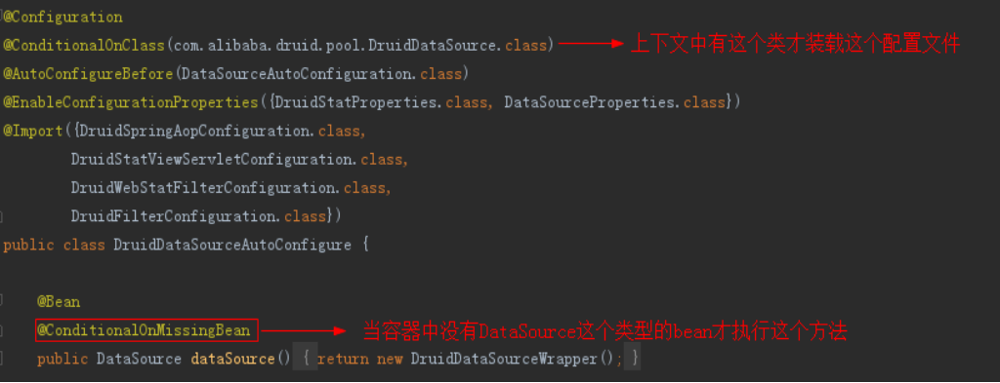

## Springboot 自动装配原理

### 源码分析
SpringBootApplication.run方法:
1. 配置类run 方法-->调用ConfigurableApplicationContext方法
    * |-- 调用refreshContext(context) : 解析配置类上的注解
2. 解析SpringApplicationContxet注解
  * |-- EnableAutoConfiguation： 自动装配注解
    * |-- 这个注解里面的@Import引入的配置类.AutoConfigurationImportSelector
        * |-- 这个类中有这个方法.SpringFactoriesLoader.loadFactoryNames(getSpringFactoriesLoaderFactoryClass(), getBeanClassLoader());
    * |-- SpringFactoriesLoader.loadFactoryNames的作用就是读取jar包中的/项目中的META-INF/spring.factories文件.
    * |-- 调用getCandidateConfiguration方法
    * |-- 通过类加载器获取spring.factories(当前项目的classpath+ 系统中的第三方jar包的classpath)
    * |-- spring.factories配置了自动装配的类.比如:com.alibaba.druid.spring.boot.autoconfigure.DruidDataSourceAutoConfigure
    * |-- 根据条件给我们自动装配Bean

相关条件注解:
@ConditionalOnBean（仅仅在当前上下文中存在某个对象时，才会实例化一个Bean）
@ConditionalOnClass（某个class位于类路径上，才会实例化一个Bean）
@ConditionalOnExpression（当表达式为true的时候，才会实例化一个Bean）
@ConditionalOnMissingBean（仅仅在当前上下文中不存在某个对象时，才会实例化一个Bean）
@ConditionalOnMissingClass（某个class类路径上不存在的时候，才会实例化一个Bean）
@ConditionalOnNotWebApplication（不是web应用）

 
---

### 相关配置作用
**spring.factories** : 配置了自动装配类
**自动装配类** : 加载配置类，创建相关配置bean对象，创建的对象存放在spring容器中
**配置类** ： 封装bean对象所需要的配置参数

### 总结:
* springboot 项目启动会扫描当前项目下所有的META-INF 下的spring.factories
* 加载自动装配类，读取配置文件信息, 创建相关的bean对象
* 配置文件信息封装在一个配置类中
* 使用时直接引入依赖，注入相关bean对象
