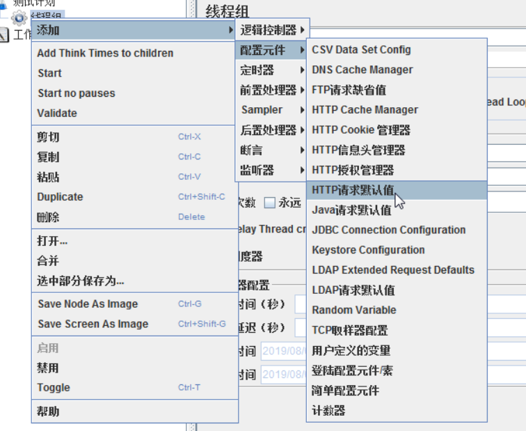
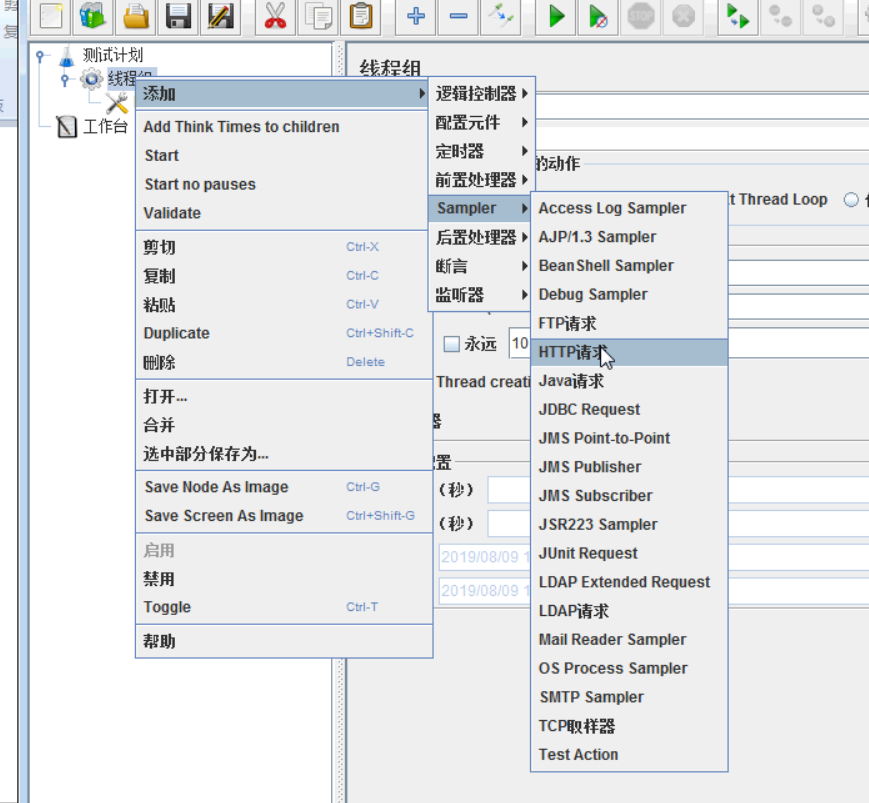
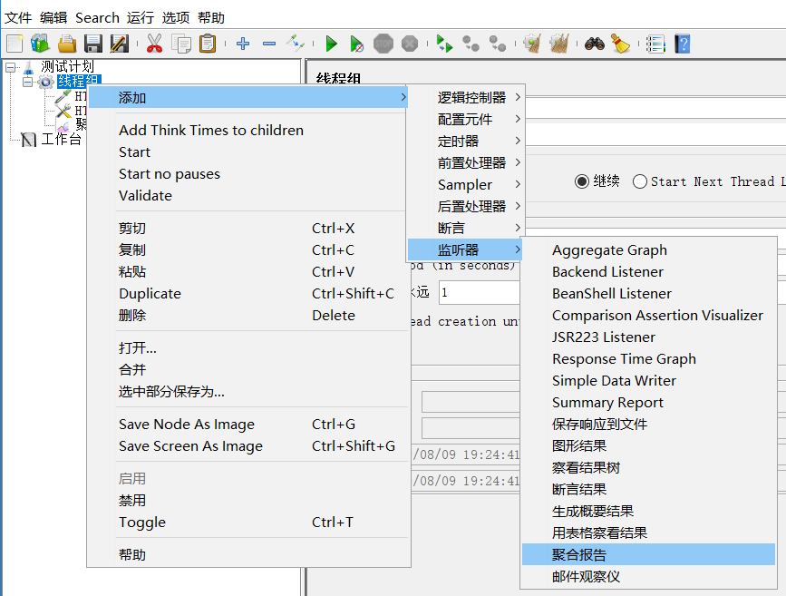
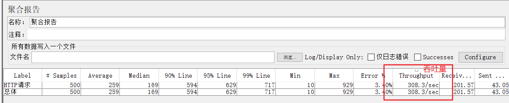
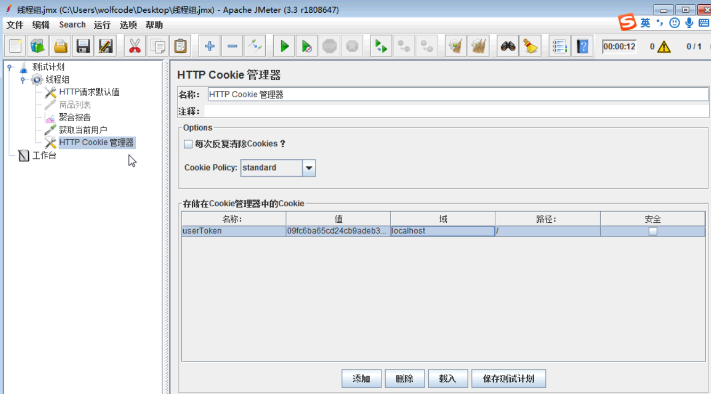
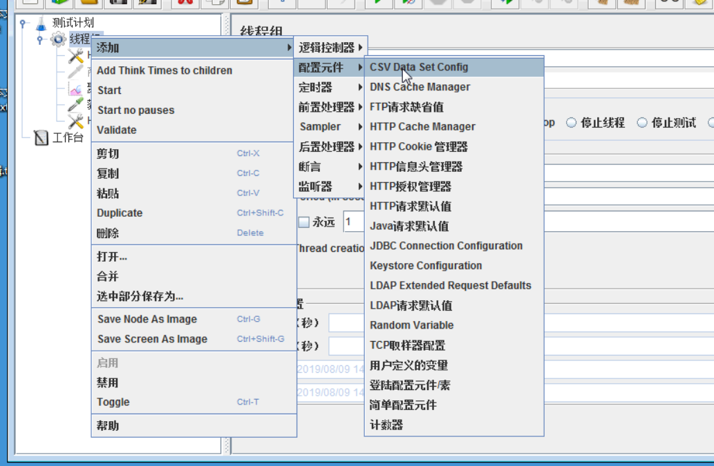
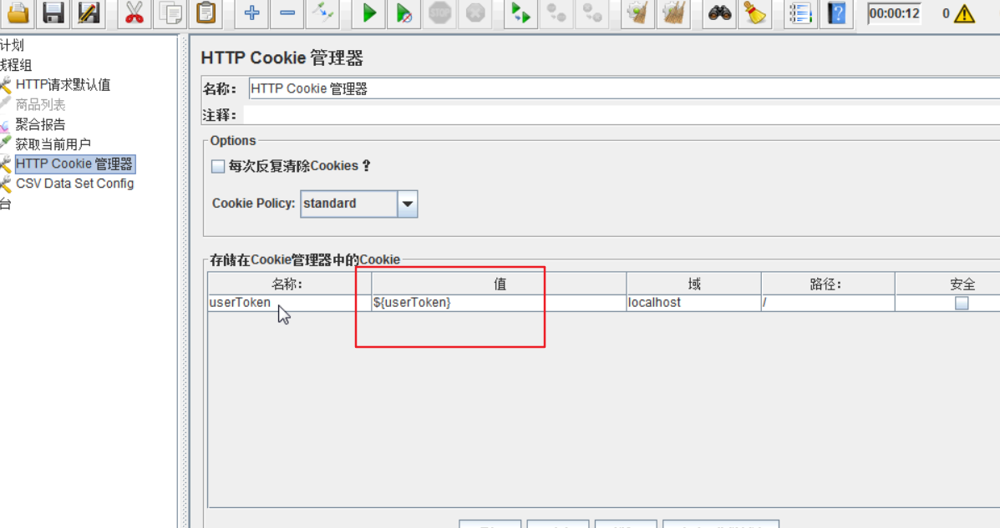
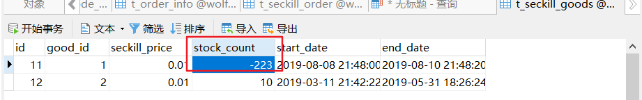

### jmeter压测

官网地址:http://jmeter.apache.org/
下载路径:http://jmeter.apache.org/download_jmeter.cgi/
用户手册:http://jmeter.apache.org/usermanual/index.html

#### 秒杀商品列表测试

1. 添加线程组

2. 添加http 请求默认值
  |-- 需要设置localhost 和 端口号(9000网关)

3. 添加Http请求
  |-- 只需要添加路径和参数即可(网关访问时会比较慢)

4. 添加聚合报告

#### 创建多个用户
* 使用工具类，在TokenController中定义initData方法，批量添加多个用户数据
* initData只执行一次，防止多次创建
* 生成多个用户token数据的配置文件

#### 测试秒杀数据

1. 禁用上一个测试
2. 清除上一次聚合报告
3. 添加cookie管理器

4. 读取生成的token的配置文件

5. 访问秒杀接口

问题:
* 请求超时;
* 重复下单;
* 库存出现负数

结果:
有可能会出现超卖现象:多线程并发会出现条件判断失效
