## 异步下单

1. 在seckill-server 集成rabbitmq
2. 在码云上添加rabbitmq.yml
3. 定义OrderMessage封装userId,uuid,seckillGoodId
4. 定义MQConstants相关配置，配置交换机的名字和相关队列名和key
5. 定义OrderListener
  * |-- handlerOrderPenddingQueue() 接收队列消息
    * |-- @Payload : 将消息数据反序列化成对象
  * |-- handleOrderResultFailQueue(Map) ：监听订单失败队列
  * |-- handleOrderResultSuccessQueue(Map): 监听订单成功
    * |-- 定义rabbitlistener会被马上监听,不能实现延时效果
    * |-- 应该只定义一个queue,创建队列bean不被监听,消息超过15s才会发送给死信队列
    * |-- 传递三个参数,用于设置超时时间，死信队列的名字
    * |-- 绑定队列和交换机的关系
  * |--handleOrderTimeOutQueue(Map) : 监听订单超时
  * |-- handleCancelLocalSignQueue
    * |-- 取消本地标识,只需要一个seckillGoodId
    * |-- @Queue 使用匿名,可以定义集群模式下，会默认创建多个不同名字的队列，从而实现广播模式
    * |-- 如果定义了名字的话，就相当于变成了worker模式

```java
@Component
public class OrderListener {
    // 接收队列消息
    //Payload : 将消息数据反序列化成对象
    @RabbitListener(queuesToDeclare = @Queue(name = MQConstants.ORDER_PEDDING_QUEUE))
    public void handleOrderPenddingQueue(@Payload OrderMessage orderMessage, @Header(AmqpHeaders.DELIVERY_TAG) Long deliveryTag, Channel channel){

    }
    // 监听订单失败队列
    @RabbitListener(bindings =@QueueBinding(
            value = @Queue(name = MQConstants.ORDER_RESULT_FAIL_QUEUE),
            exchange = @Exchange(name = MQConstants.ORDER_RESULT_EXCHANGE,type = "topic"),
            key = MQConstants.ORDER_RESULT_FAIL_KEY
    ))
    public void handleOrderResultFailQueue(@Payload Map<String,Object> param, @Header(AmqpHeaders.DELIVERY_TAG) Long deliveryTag, Channel channel){

    }

    // 监听订单成功队列 -->  定义rabbitlistener会被马上监听,不能实现延时效果
    // 应该只定义一个queue,不被监听
    //传递三个参数
   @Bean
   public org.springframework.amqp.core.Queue delayQueue(){
       Map<String,Object> arguments = new HashMap<>();
       arguments.put("x-dead-letter-exchange",MQConstants.DELAY_EXCHANGE);
       arguments.put("x-dead-letter-routing-key",MQConstants.ORDER_DELAY_KEY);
       arguments.put("x-message-ttl",1000*60*15);
       org.springframework.amqp.core.Queue queue = new org.springframework.amqp.core.Queue(MQConstants.ORDER_RESULT_SUCCESS_DELAY_QUEUE,true,false,false,arguments);
       return queue;
   }
   // 绑定订单成功队列 和交换机的关系
    @Bean
    public Binding binding1a(org.springframework.amqp.core.Queue delayQueue) {
        return BindingBuilder.bind(delayQueue)
                .to(new TopicExchange(MQConstants.ORDER_RESULT_EXCHANGE))
                .with(MQConstants.ORDER_RESULT_SUCCESS_KEY);
    }

    // 监听订单超时
    @RabbitListener(bindings =@QueueBinding(
            value = @Queue(name = MQConstants.ORDER_TIMEOUT_QUEUE),
            exchange = @Exchange(name = MQConstants.DELAY_EXCHANGE,type = "topic"),
            key = MQConstants.ORDER_DELAY_KEY
    ))
    public void handleOrderTimeOutQueue(@Payload Map<String,Object> param, @Header(AmqpHeaders.DELIVERY_TAG) Long deliveryTag, Channel channel){

    }

    //  取消本地标识
    @RabbitListener(bindings = @QueueBinding(
            value = @Queue,  //实现匿名
            exchange = @Exchange(name = MQConstants.SECKILL_OVER_SIGN_PUBSUB_EX,type = "fanout")
    ))
    public void handleCancelLocalSignQueue(@Payload Long seckillGoodId, @Header(AmqpHeaders.DELIVERY_TAG) Long deliveryTag, Channel channel){}
}

```

<!--
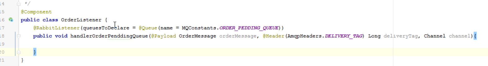

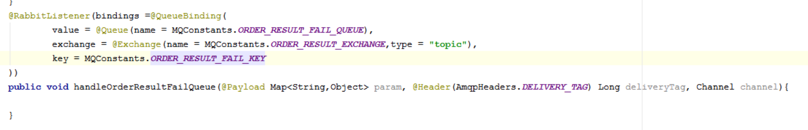

不适用这种方式
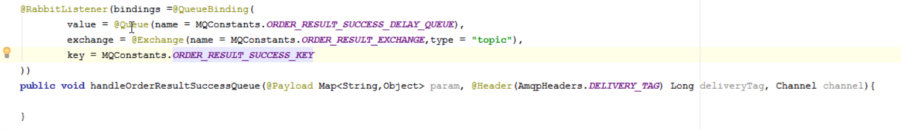
应该使用这种方式
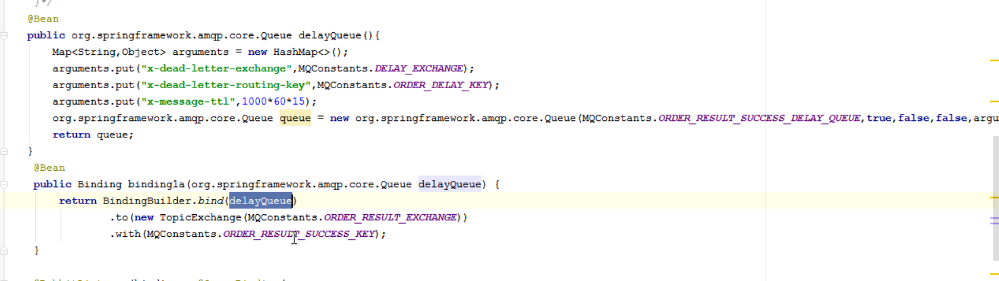

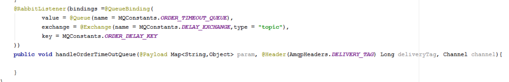

-->


## 发送消息
1. 在orderInfoController中定义rabbitTemplate
2. 创建一个OrderMessage(封装uuid,user.getId,seckillGoodId)
3. 使用rabbitTemplate发送消息给消息队列
4. 在OrderMQListener书写消息监听逻辑

5. 处理订单消息队列
    * |-- 从队列中获取消息参数对象 OrderMessage
    * |-- 根据seckillGoodId 和 userId  创建订单
    * |-- 创建成功发送key=Order.success 给订单处理交换机
    * |-- 创建失败发送key=Order.fail 给订单处理交换机

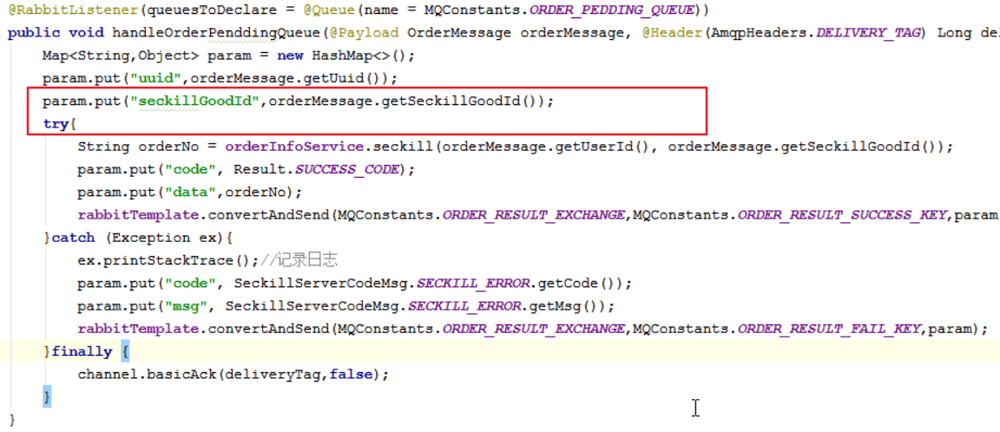


6. 处理订单失败
    |-- 取消本地标识,发送消息给本地标识交换机
    |-- 重置预库存,将真实数据库中的库存数据同步到redis中
    |-- 出现异常时，可以往MQ中放消息，监听这个消息，接着通知后台或者运维人员(发送短信/邮件),收到短信/邮件之后，登陆后台管理进行手工同步

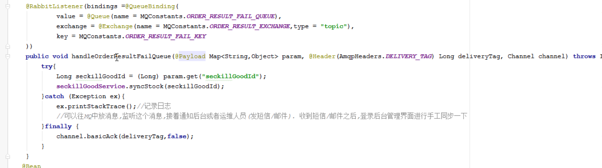
<br>
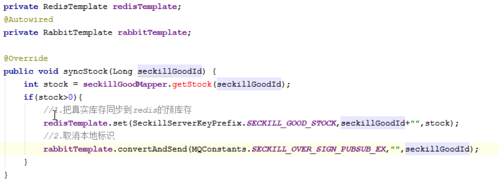


7. 取消本地标识
  |-- 出现异常时，可以往MQ中放消息，监听这个消息，接着通知后台或者运维人员(发送短信/邮件),收到短信/邮件之后，登陆后天管理进行手工同步

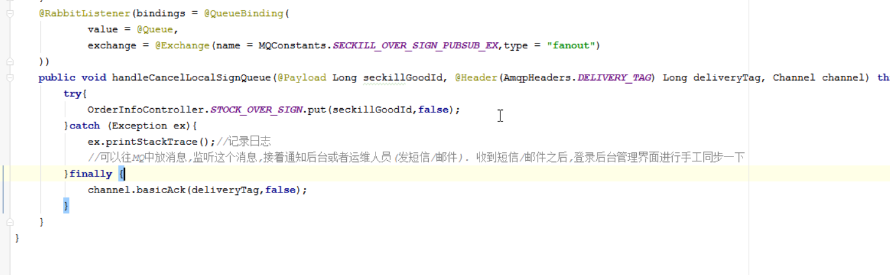


8. 取消订单/处理超时订单
  |-- 如果订单是已经支付状态或者用户手动取消订单状态不做处理
  |-- 能处理的是订单未支付状态才修改订单状态为超时订单
  |-- 修改订单为超时订单状态
  |-- 刚好在15分钟，在操作这超时取消订单逻辑的时候，付款了或者手动取消订单
  |-- 超时取消成功后，真实库存+1
  |-- 同步预库存，取消本地标识
  |-- 添加事务
  |-- 支付和取消在同一时间段的时候,先支付，后走退款流程

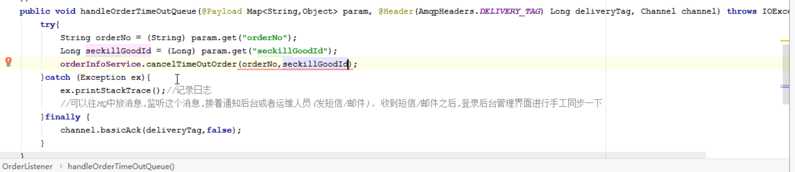
<br>
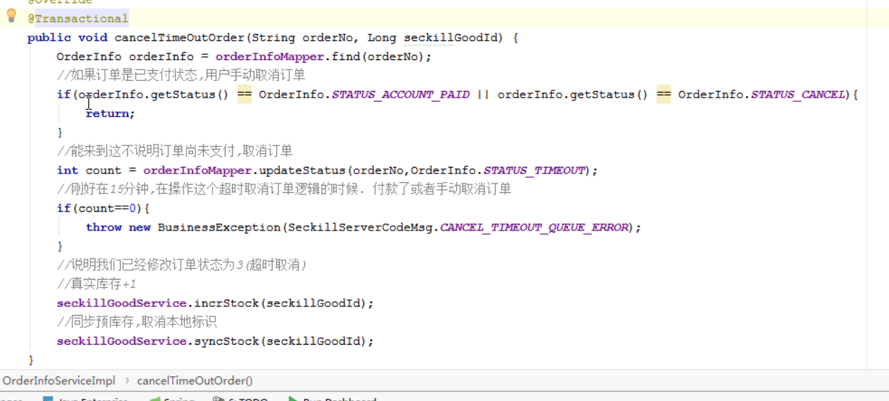

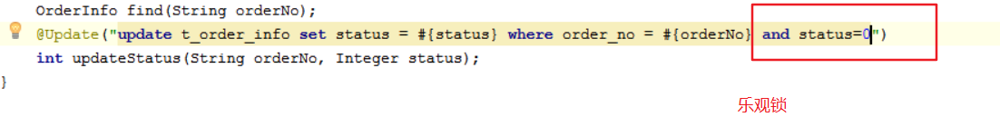
