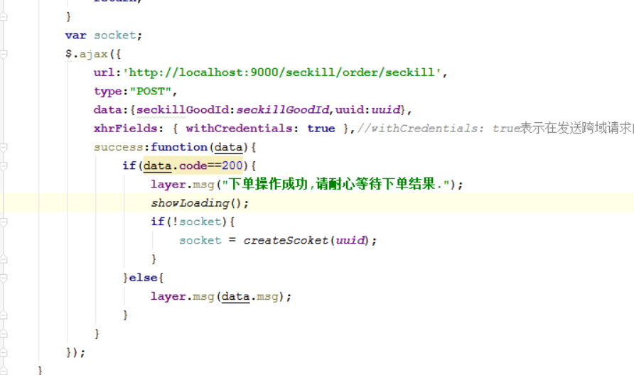
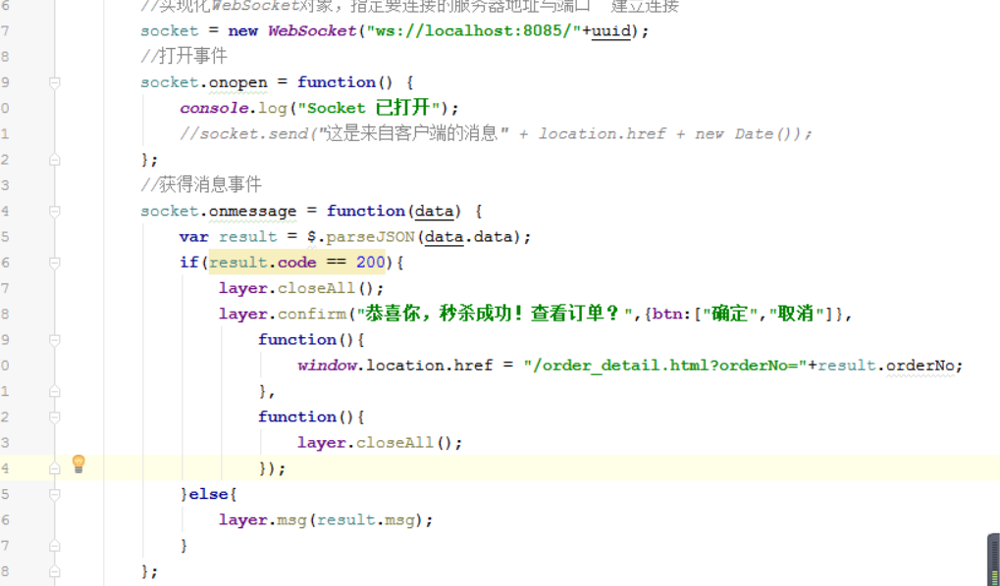
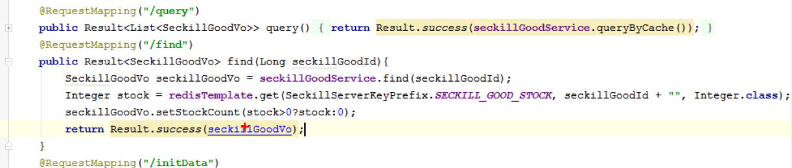

### websocket-server
1. 创建websocket-server-->8085
2. 拷贝config 和 server 不需要 onMessage
3. 导入springboot-amqp 依赖
4. 添加rabbitmq 相关配置
5. 书写OrderListener
    |-- handleOrderResultNotifyQueue()
      |-- 获取uuid参数
      |-- 根据uuid 获取webSocketServer对象
      |-- 通过session将数据转换成json数据响应给前端
      |-- 如果消费队列中的消息比建立socket连接要快,在消费消息的方法上，休眠一段时间，循环三次去等待建立连接,如果连接建立不了就不再连接

前端页面
1. 创建uuid , 发送请求时携带uuid
2. 响应结果中 , 如果时200建立socket连接
3. 获取socket数据

### 测试
1. 测试失败情况下预库存和取消本地标识是否成功设置
2. 测试超时订单
3. 库存显示时，从redis中读取缓存库存

面试题
redis 主从分离时，
* 所有的写操作都是在主操作
* 主和从都可以进行读的操作
1. 当在主数据库中进行数据修改，需要同步到从数据库中
