## websocket 测试案例

参考网站: https://www.runoob.com/html/html5-websocket.html


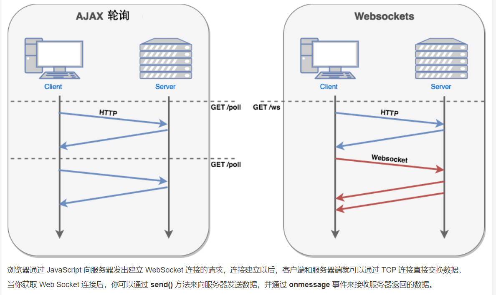


### 前端项目 fronted-server
步骤:
1. 创建index.html,index2.html,导入jquery
2. 复制socket.js的方法
3. 定义开始连接stratConnection(),点击创建socket
4. 定义发送消息sendMsg(),调用socket.send(msg)

```html
<script>
    function createScoket(uuid){
        var socket;
        if(typeof(WebSocket) == "undefined") {
            console.log("您的浏览器不支持WebSocket");
        }else{
            //实现化WebSocket对象，指定要连接的服务器地址与端口  建立连接
            socket = new WebSocket("ws://localhost:8085/"+uuid);
            //打开事件
            socket.onopen = function() {
                console.log("Socket 已打开");
                //socket.send("这是来自客户端的消息" + location.href + new Date());
            };
            //获得消息事件
            socket.onmessage = function(data) {
                console.log("接收到websocket服务端发送的消息:");
                console.log(data);
            };
            //关闭事件
            socket.onclose = function() {
                console.log("Socket已关闭");
            };
            //发生了错误事件
            socket.onerror = function() {
                console.log("Socket发生了错误");
            }
            //窗口关闭
            $(window).unload(function(event){
                socket.close();
            });
        }
        return socket;
    }

    // 连接对象
    var socket;
    /* 开始连接 */
    function openSocket() {
        socket=createScoket("decade");
    }

    // 发送消息到websocket服务器
    function sendMsg() {
        var msg=$("#msg").val();
        socket.send(msg);
    }
</script>

</head>
<body>

<input type="button" value="开始连接" onclick="openSocket()">
<input type="text" id="msg">
<input type="button" value="发送消息" onclick="sendMsg()">
</body>
```

### 后端项目 websocket-server
1. 导入web-socket依赖
```xml
<!-- websocket依赖 -->
 <dependency>
     <groupId>org.springframework.boot</groupId>
     <artifactId>spring-boot-starter-websocket</artifactId>
 </dependency>
```
2. 定义WebSocketConfig配置类,定义了一个bean扫描对应的ServerEnpoint注解，发布websocket服务

```java
@Configuration
public class WebSocketConfig {
    // 扫描ServerEndpoint,启动连接
    @Bean
    public ServerEndpointExporter getServerEndpointExporter(){
        return new ServerEndpointExporter();
    }
}
```

2. 定义WebSocketServer类
    * |-- @ServerEndpoint("/{uuid}")--> 注解接收地址栏传参
    * |-- onOpen() : 与客户端连接时触发
      * |-- session : 建立会话
    * |-- onMessage() : 前端发送消息时触发
    * |-- onClose() :  连接关闭时触发
    * |-- onError() : 出现异常时触发
3. 建立连接时，将客户端和对应的socket对象存放ConcurrentHashMap
4. 关闭连接时，ConcurrentHashMap中移除客户端
5. 提供session对象的set/get方法

```java
@ServerEndpoint("/{uuid}")  // 访问路径参数占位符
@Component
public class WebSocketServer {

    // 会话对象
    private Session session;
    public static ConcurrentHashMap<String,WebSocketServer> clients = new ConcurrentHashMap<>();
    @OnOpen
    public void onOpen(Session session, @PathParam( "uuid") String uuid){
        System.out.println("uuid:"+uuid+",和服务器已经建立连接");
        this.session = session;
        clients.put(uuid,this);// 开始连接时，将当前对象和用户唯一标识匹配起来
    }

    @OnMessage
    public void onMessage(@PathParam( "uuid") String uuid,String msg){
        System.out.println("客户端:"+uuid+",给服务器发送的消息内容:"+msg);
    }

    @OnClose
    public void onClose(@PathParam( "uuid") String uuid){
        clients.remove(uuid);
    }
    @OnError
    public void onError(Throwable error) {
        error.printStackTrace();
    }

    public Session getSession() {
        return session;
    }

    public void setSession(Session session) {
        this.session = session;
    }
}
```

5. 定义SendMsgController
  |-- 获取客户端,通过客户端获取uuid对应的WebSocketServer对象
  |-- 通过客户端获取session对象,发送消息到客户端

相关代码
```java
@RestController
public class SendMsgController {
    @RequestMapping("sendMsg")
    public String sendMsg(String uuid,String msg) throws IOException {
        // 根据当前uuid查询对应的websocket服务对象
        WebSocketServer webSocketServer = WebSocketServer.clients.get(uuid);
        if(webSocketServer!=null){
            webSocketServer.getSession().getBasicRemote().sendText(msg);
        }
        return "发送成功";
    }
}
```


## 异步下单

1. 在seckill-server 集成rabbitmq
2. 在码云上添加rabbitmq.yml
3. 定义OrderMessage封装userId,uuid,seckillGoodId
4. 定义MQConstants相关配置，配置交换机的名字和相关队列名和key
5. 定义OrderListener
  * |-- handlerOrderPenddingQueue() 接收队列消息
    * |-- @Payload : 将消息数据反序列化成对象
  * |-- handleOrderResultFailQueue(Map) ：监听订单失败队列
  * |-- handleOrderResultSuccessQueue(Map): 监听订单成功
    * |-- 定义rabbitlistener会被马上监听,不能实现延时效果
    * |-- 应该只定义一个queue,创建队列bean不被监听,消息超过15s才会发送给死信队列
    * |-- 传递三个参数,用于设置超时时间，死信队列的名字
    * |-- 绑定队列和交换机的关系
  * |--handleOrderTimeOutQueue(Map) : 监听订单超时
  * |-- handleCancelLocalSignQueue
    * |-- 取消本地标识,只需要一个seckillGoodId
    * |-- @Queue 使用匿名,可以定义集群模式下，会默认创建多个不同名字的队列，从而实现广播模式
    * |-- 如果定义了名字的话，就相当于变成了worker模式

```java
@Component
public class OrderListener {
    // 接收队列消息
    //Payload : 将消息数据反序列化成对象
    @RabbitListener(queuesToDeclare = @Queue(name = MQConstants.ORDER_PEDDING_QUEUE))
    public void handleOrderPenddingQueue(@Payload OrderMessage orderMessage, @Header(AmqpHeaders.DELIVERY_TAG) Long deliveryTag, Channel channel){

    }
    // 监听订单失败队列
    @RabbitListener(bindings =@QueueBinding(
            value = @Queue(name = MQConstants.ORDER_RESULT_FAIL_QUEUE),
            exchange = @Exchange(name = MQConstants.ORDER_RESULT_EXCHANGE,type = "topic"),
            key = MQConstants.ORDER_RESULT_FAIL_KEY
    ))
    public void handleOrderResultFailQueue(@Payload Map<String,Object> param, @Header(AmqpHeaders.DELIVERY_TAG) Long deliveryTag, Channel channel){

    }

    // 监听订单成功队列 -->  定义rabbitlistener会被马上监听,不能实现延时效果
    // 应该只定义一个queue,不被监听
    //传递三个参数
   @Bean
   public org.springframework.amqp.core.Queue delayQueue(){
       Map<String,Object> arguments = new HashMap<>();
       arguments.put("x-dead-letter-exchange",MQConstants.DELAY_EXCHANGE);
       arguments.put("x-dead-letter-routing-key",MQConstants.ORDER_DELAY_KEY);
       arguments.put("x-message-ttl",1000*60*15);
       org.springframework.amqp.core.Queue queue = new org.springframework.amqp.core.Queue(MQConstants.ORDER_RESULT_SUCCESS_DELAY_QUEUE,true,false,false,arguments);
       return queue;
   }
   // 绑定订单成功队列 和交换机的关系
    @Bean
    public Binding binding1a(org.springframework.amqp.core.Queue delayQueue) {
        return BindingBuilder.bind(delayQueue)
                .to(new TopicExchange(MQConstants.ORDER_RESULT_EXCHANGE))
                .with(MQConstants.ORDER_RESULT_SUCCESS_KEY);
    }

    // 监听订单超时
    @RabbitListener(bindings =@QueueBinding(
            value = @Queue(name = MQConstants.ORDER_TIMEOUT_QUEUE),
            exchange = @Exchange(name = MQConstants.DELAY_EXCHANGE,type = "topic"),
            key = MQConstants.ORDER_DELAY_KEY
    ))
    public void handleOrderTimeOutQueue(@Payload Map<String,Object> param, @Header(AmqpHeaders.DELIVERY_TAG) Long deliveryTag, Channel channel){

    }

    //  取消本地标识
    @RabbitListener(bindings = @QueueBinding(
            value = @Queue,  //实现匿名
            exchange = @Exchange(name = MQConstants.SECKILL_OVER_SIGN_PUBSUB_EX,type = "fanout")
    ))
    public void handleCancelLocalSignQueue(@Payload Long seckillGoodId, @Header(AmqpHeaders.DELIVERY_TAG) Long deliveryTag, Channel channel){}
}

```

<!--


不适用这种方式

应该使用这种方式
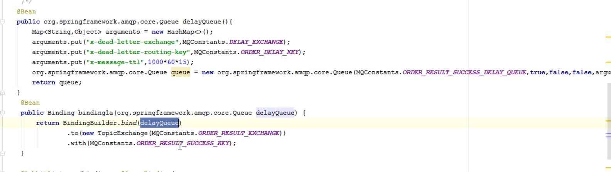

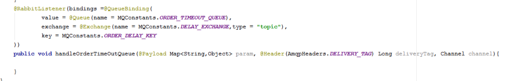

-->


## 发送消息
1. 在orderInfoController中定义rabbitTemplate
2. 创建一个OrderMessage(封装uuid,user.getId,seckillGoodId)
3. 使用rabbitTemplate发送消息给消息队列
4. 在OrderMQListener书写消息监听逻辑

5. 处理订单消息队列
    * |-- 从队列中获取消息参数对象 OrderMessage
    * |-- 根据seckillGoodId 和 userId  创建订单
    * |-- 创建成功发送key=Order.success 给订单处理交换机
    * |-- 创建失败发送key=Order.fail 给订单处理交换机

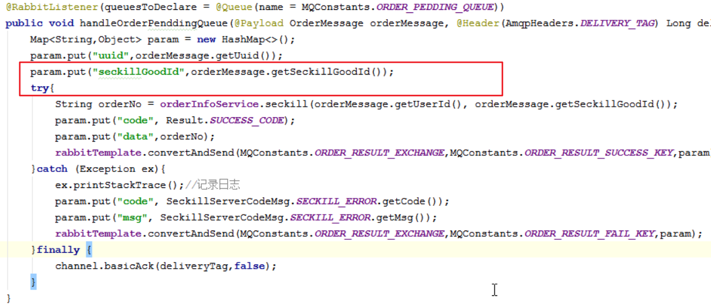


6. 处理订单失败
    |-- 取消本地标识,发送消息给本地标识交换机
    |-- 重置预库存,将真实数据库中的库存数据同步到redis中
    |-- 出现异常时，可以往MQ中放消息，监听这个消息，接着通知后台或者运维人员(发送短信/邮件),收到短信/邮件之后，登陆后台管理进行手工同步

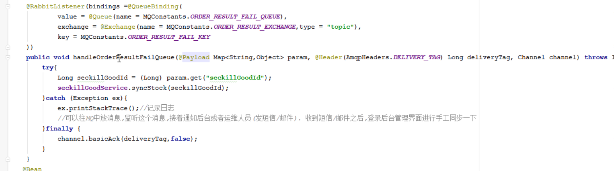
<br>
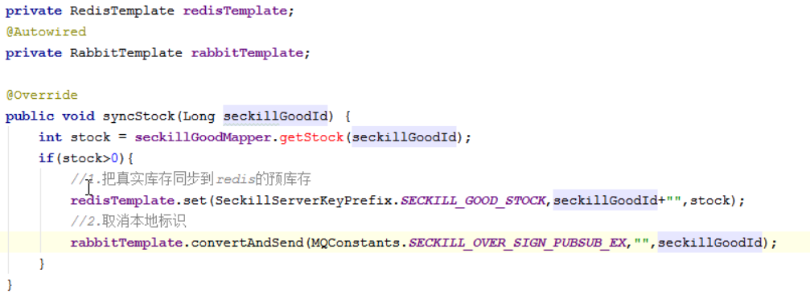


7. 取消本地标识
  |-- 出现异常时，可以往MQ中放消息，监听这个消息，接着通知后台或者运维人员(发送短信/邮件),收到短信/邮件之后，登陆后天管理进行手工同步

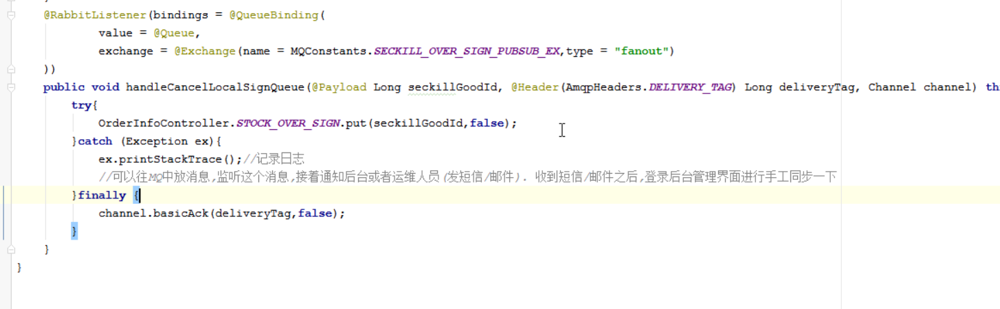


8. 取消订单/处理超时订单
  |-- 如果订单是已经支付状态或者用户手动取消订单状态不做处理
  |-- 能处理的是订单未支付状态才修改订单状态为超时订单
  |-- 修改订单为超时订单状态
  |-- 刚好在15分钟，在操作这超时取消订单逻辑的时候，付款了或者手动取消订单
  |-- 超时取消成功后，真实库存+1
  |-- 同步预库存，取消本地标识
  |-- 添加事务
  |-- 支付和取消在同一时间段的时候,先支付，后走退款流程

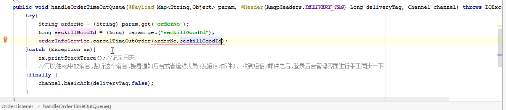
<br>


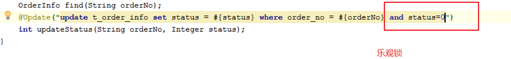

### websocket-server
1. 创建websocket-server-->8085
2. 拷贝config 和 server 不需要 onMessage
3. 导入springboot-amqp 依赖
4. 添加rabbitmq 相关配置
5. 书写OrderListener
    |-- handleOrderResultNotifyQueue()
      |-- 获取uuid参数
      |-- 根据uuid 获取webSocketServer对象
      |-- 通过session将数据转换成json数据响应给前端
      |-- 如果消费队列中的消息比建立socket连接要快,在消费消息的方法上，休眠一段时间，循环三次去等待建立连接,如果连接建立不了就不再连接


前端页面
1. 创建uuid , 发送请求时携带uuid
2. 响应结果中 , 如果时200建立socket连接
3. 获取socket数据

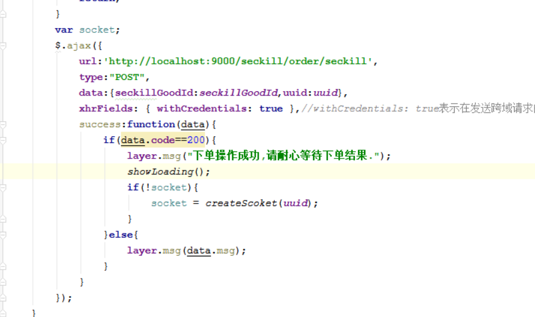
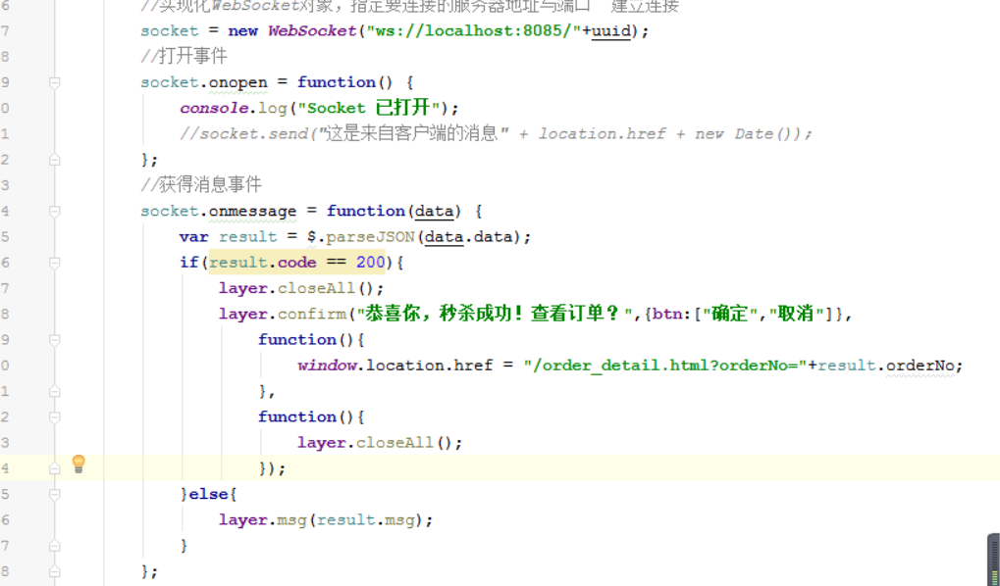

### 测试
1. 测试失败情况下预库存和取消本地标识是否成功设置
2. 测试超时订单
3. 库存显示时，从redis中读取缓存库存
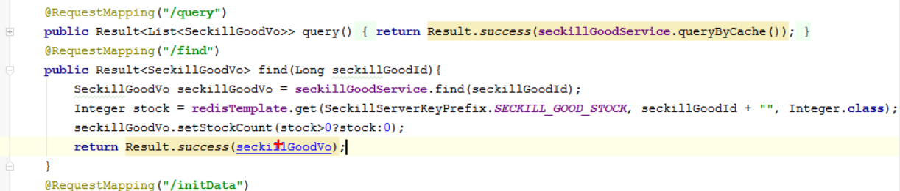

面试题
redis 主从分离时，
* 所有的写操作都是在主操作
* 主和从都可以进行读的操作
1. 当在主数据库中进行数据修改，需要同步到从数据库中
