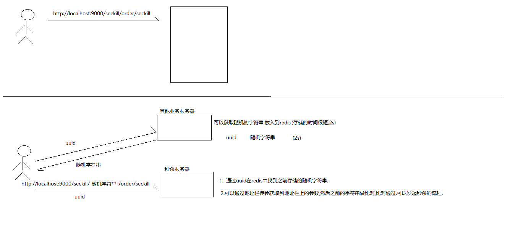
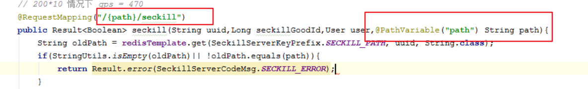
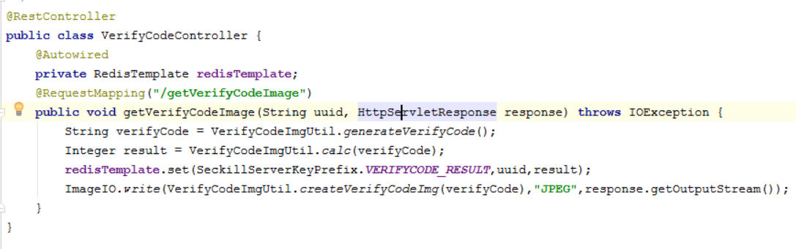
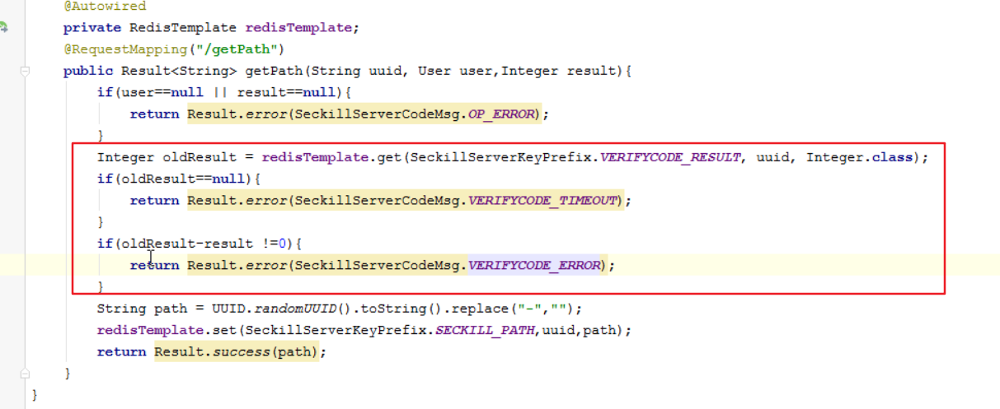
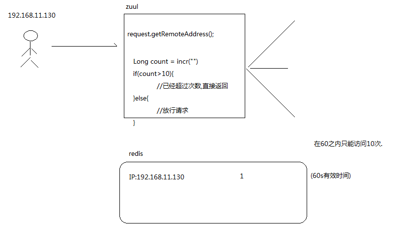
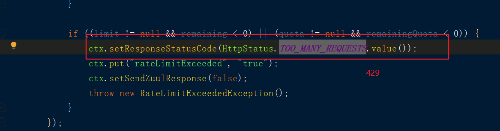
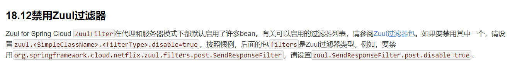
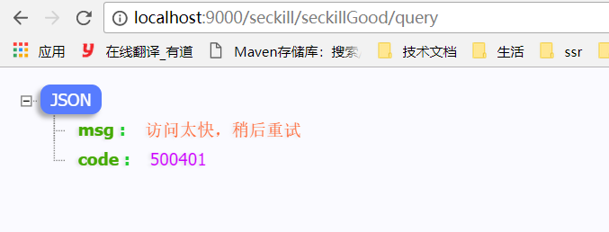
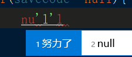

## 隐藏秒杀地址

秒杀实现:


为什么需要俩台服务器?
* 将随机字符串放在另外一台服务器，避免秒杀服务器高并发访问


开发步骤:
1. 定义一个PathController,getPath(uuid,user)
    |-- 用户需要进行登陆
2. 生成一个随机的字符串,保存到redis中
    |-- key=seckill_path
    |-- 俩秒钟
3. 前端定义doGetPath(),验证码发送成功调用doSeckill
4. doSeckill()方法修改请求路径
5. seckill方法上，获取path,去redis中进行校验

```java
@RestController
public class PathController {
    @Autowired
    private RedisService redisService;
    @RequestMapping("/getPath")
    public Result<String> getPath(Long goodId,Integer verifyCode,String uuid,User user){
        if(user==null){
            return Result.error(SeckillServerCodeMsg.LOGIN_ERROR);
        }
        ...
        String path = UUID.randomUUID().toString().replace("-","");
        redisService.set(SeckillKeyPrefix.SECKILL_PATH,user.getId()+":"+goodId,path);
        return Result.success(path);
    }
}
```

```js
// 获取随机字符
function doGetPath() {
    $.ajax({
        url: "http://localhost:9000/seckill/getPath",
        type: "POST",
        data:{uuid:uuid,verityCode:$("#verifyCode").val()},
        xhrFields: {withCredentials: true},//withCredentials: true表示在发送跨域请求的时候需要把cookie信息带上.
        success: function (data) {
            if (data.code == 200) {
                doSeckill(data.data);
            } else {
                layer.msg(data.msg);
            }
        },
        error: function () {
            layer.msg("客户端调用异常");
        }
    })
}
```


seckill方法上，获取path,去redis中进行校验



## 图形验证码
作用:
* 防止用户频繁点击
* 拦截大部分请求 ，可以避免高并发场景

步骤:

#### 后端开发
1. 创建VerifyCodeController.getVerifyCodeController(uuid,resp)
2. 生成验证码verifyCode,根据表达式计算出结果
3. 将结果数据保存在redis
    |-- key ：uuid
    |-- value : result
    |-- 300s
4. 将验证码图片返回页面 ImageIO.write
5. 在getPath接口上，从redis 中获取验证码，进行校验
    |--如果获取veritycode==null，提示验证码过时
    |--如果验证码不一致，提示验证码不一致

<br>



#### 前端页面:
1. 登陆情况下才能显示验证码图片
2. initVerifyCodeImg()：设置图片地址
3. 请求获取验证码是get请求会有缓存，需要加时间戳
4. 在getPath 接口传递验证码

```js
function initVerifyCodeImg() {
       $("#verifyCodeImg").prop("src","http://localhost:9000/seckill/getVerifyCode?uuid="+uuid+"&timstrap="+new Date().getTime());
   }
```


## 接口限流防刷
需求: 同一个ip 在60s之内只能刷新10次
思路分析:
1. 在zuul 网关获取请求的ip 地址
2. 使用redis保存刷新次数
    |-- 超多次数，直接返回
    |-- 否则直接放行请求




### 使用ratelimit 限流算法:
开发步骤：
1. 添加相关依赖:zuul-ratelimit + redis依赖

```xml
<!-- ratelimit ：zuul 防刷限流 -->
<dependency>
    <groupId>com.marcosbarbero.cloud</groupId>
    <artifactId>spring-cloud-zuul-ratelimit</artifactId>
    <version>2.2.3.RELEASE</version>
</dependency>

<dependency>
    <groupId>org.springframework.boot</groupId>
    <artifactId>spring-boot-starter-data-redis</artifactId>
</dependency>
```
2. 在zuul-server.yml上配置ratelimit
参考网站 ： https://github.com/marcosbarbero/spring-cloud-zuul-ratelimit
3. 添加redis的配置
3. zuul 网关默认情况下，出错是跳转错误页面
5. 怎么修改zul网关的默认错误处理，

zuul-server.yml配置
```yml
zuul:
  SendErrorFilter:
    error:
      disable: true
  ratelimit:
    key-prefix: ratelimit   #  ratelimit 存在radis key的前缀
    enabled: true
    repository: REDIS
    behind-proxy: true
    add-response-headers: true
    default-policy-list:
      - limit: 10  # 刷新次数
        refresh-interval: 60 # 刷新时间
        type:
          - origin  # 针对ip进行拦截
### -user 针对用户
```


### zuul 网关默认情况下，出错时跳转页面
需求:
* 做了前后端分离，后端无论什么情况都需要返回json数据
* 怎么修改zuul网关的默认错误处理，修改成返回json数据
  * 禁用SendErrorFilter，自己定义一个errorFilter
zuul我网关出错流程:
RateLimitPreFilter--> run()-->出错-->SendErrorFilter---转发-->BaseErrorController



### 禁用zuulfilter
官方文档: https://cloud.spring.io/spring-cloud-static/Greenwich.SR2/single/spring-cloud.html#_disable_zuul_filters


禁用设置 :zuul.简单类名.过滤类型.disable=true

```yml
zuul:
  SendErrorFilter:  # 简单类名
    error: # 过滤类型
      disable: true
```

#### 自定义ErrorReturnJSONDataFilter

实现步骤:
1. 定义一个类继承ZuulFilter;
2. 实现方法，方法逻辑和SendErrorFilter一样;
3. 重新写run方法，出现异常时，将异常数据返回

```java
@Component
public class ErrorReturnJSONDataFilter extends ZuulFilter {


    protected static final String SEND_ERROR_FILTER_RAN = "sendErrorFilter.ran";


    @Override
    public String filterType() {
        return ERROR_TYPE;
    }

    @Override
    public int filterOrder() {
        return SEND_ERROR_FILTER_ORDER;
    }

    @Override
    public boolean shouldFilter() {
        RequestContext ctx = RequestContext.getCurrentContext();
        // only forward to errorPath if it hasn't been forwarded to already
        return ctx.getThrowable() != null
                && !ctx.getBoolean(SEND_ERROR_FILTER_RAN, false);
    }

    @Override
    public Object run() throws ZuulException {
        RequestContext ctx = RequestContext.getCurrentContext();
        Map<String,Object> map=new HashMap<>();

        if("true".equals(ctx.get("rateLimitExceeded"))){ //刚问多次
            ctx.setResponseStatusCode(HttpStatus.TOO_MANY_REQUESTS.value());
            // 提示访问太快，稍后重试
            map.put("code",500401);
            map.put("msg","访问太快，稍后重试");
        }else{
            //系统异常
            map.put("code",500402);
            map.put("msg","系统异常");
            ctx.setResponseStatusCode(HttpStatus.INTERNAL_SERVER_ERROR.value());

        }

        HttpServletResponse response = ctx.getResponse();
        try {
            response.setContentType("application/json;charset=utf-8");
            response.getWriter().println(JSON.toJSONString(map));
            ctx.setSendZuulResponse(false);//不再往后传递
        } catch (IOException e) {
            e.printStackTrace();
        }
        return null;
    }
}
```

结果如下:



