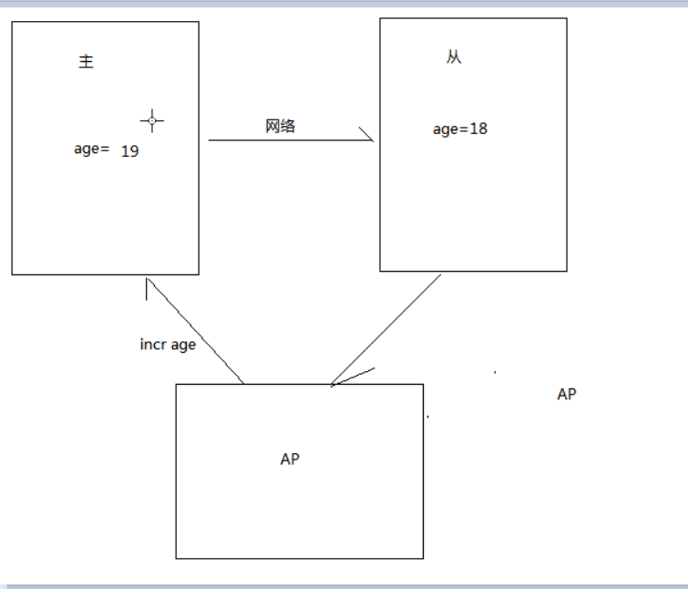

### 什么是分布式事务
在同一事务中的操作有多个服务，每一个服务操作不同的数据库

### 怎么处理分布式事务的问题？
1. 如果在设计的过程中能避免分布式问题就尽量避免(分布式事务都会导致性能比较低)
2. 如果在设计角度是无法避免分布式事务问题，需要去处理
    * |-- 考察业务出错的频率，如果出错频率很低，影响范围小,可以却解决分布式事务问题，出现了就人工处理,业务量比较小，比较稳定不会出错
    * |-- 如果出错频率很高，影响范围大,才会考虑分布式事务的解决方案

### 常见的分布式事务解决方案
1. 基于MQ 可靠消息实现数据最终一致性(对数据实时性要求相对没那么高的)
2. 使用开源的分布式事务解决方案:
    TCC-transaction,Byte-TCC,LCN,GTS

局限性:
* 如果RM 不支持AX 协议，此时就不能使用事务管理这种方式
* TM 事务管理器是单点，如果TM 宕机就会导致业务

### CPA定理
定理: 对于共享数据系统，最多之恩那个同事拥有CAP其中的俩个,没法三者兼顾
redis 主从是CP 还是 AP?
AP : 一致性，数据发生改变查询出来的数据应该保一致
CP : 可用性,当主服务器宕机了，访问从服务器

### MQ 消息发送和消息投递的可靠性

### 消息一致性
消息一致性 : 产生消息的

MQ 使用场景:
A 业务和B 业务不能同时成功的不能使用
如 订单和转账

生产者预发送消息
  |--》存放到消息服务库
业务操作-->业务数据库
发送业务操作结果

预发送失败时:回滚数据
预发送响应失败:
    |--> 消息服务库中存在垃圾数据
发送业务操作结果:
    |-- 不会等待操作结果
