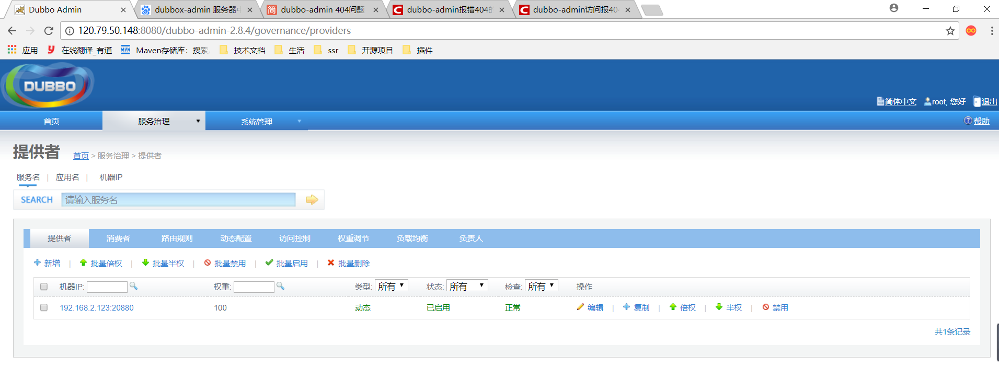

### 

---

dubbo-admin 404问题

解决方法：
1.输入cd zookeeper-3.4.6/bin/进入bin目录，再输入./zkServer.sh start启动zookeeper。
2.cd apache-tomcat-7.0.52/bin 进入tomcat的bin目录，再输入./startup.sh启动tomcat。
（注意：需要先启动zookeeper，再启动tomcat）
浏览器输入 http://120.79.50.148:8080/dubbo-admin-2.8.4 就可以访问
