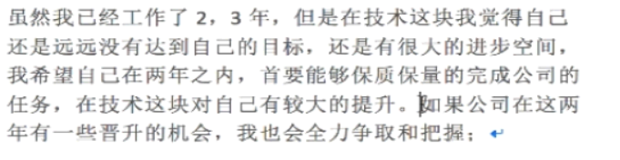
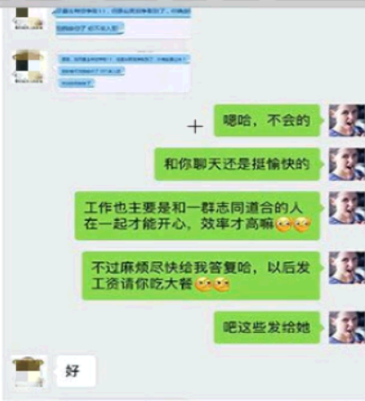
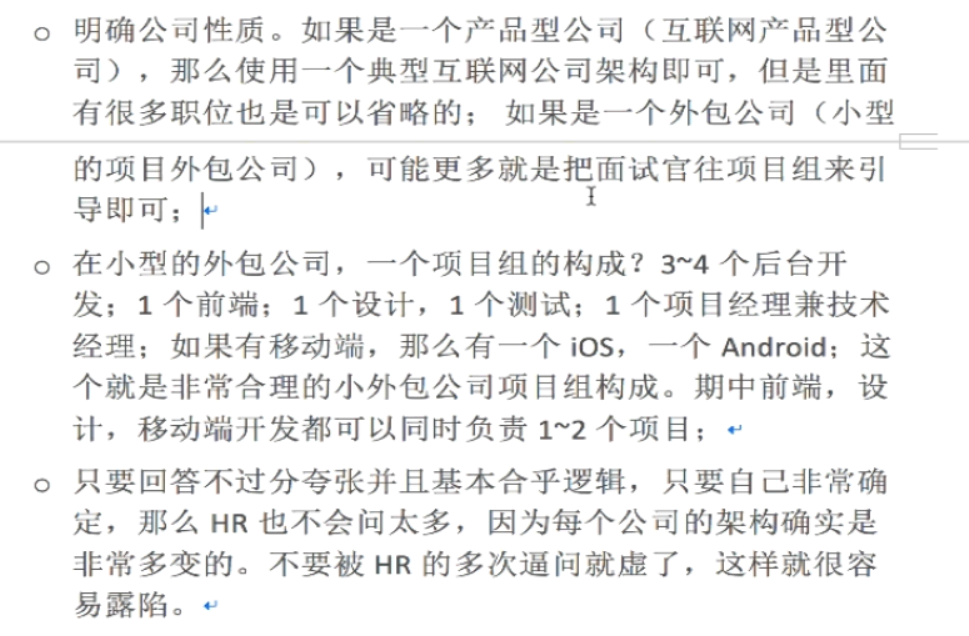

面试的基本原则是交流
怎么引导面试官，怎么处理冷场，怎么反问，怎么探讨问题

面试前准备
1. 投简历之前需要对面试的公司有一个大概的了解(简单了解)
2. 面试之前需要对面试的公司有全面的了解(进去官网了解,天眼查查询)

面试题的准备:
1. 刷题
2. 面试题复习重点
    |-- 面试过程中自己准备的面试题
3. java中常见的数据结构,算法(常见的排序算法)

面试的流程:
到场:
1. 提前5分钟达到公司
2. 联系公司HR时，确认是否能联系

面试开场:主动自我介绍
1. 自我介绍是给面试官一些时间查看简历
2. 缓解紧张

回答问题:
* 听清面试题再回答
* 没有听懂面试题，可以适当反问或追问,不要答非所问
    |-- 比如问什么是spring时?
    |-- 反问一下，具体要问哪个模块
* 问题没有听过，简单回答不知道，证明学习能力
    |-- 如果问道redis怎么优化?
    |-- 由技术经理做的
* 学习途径
    |-- 查看官方文档
    |-- 到论坛查看技术点
    |-- 买书或者看视频

面试结束:
* 不要问福利待遇问题
* 公司的技术发展方向时什么样的
* 公司的技术路线是什么样的
* 会负责哪些模块的开发
* 公司的工作氛围
* 加班制度
* 附近房租
* 是否有岗前培训/或者是技术讨论会这样的培训

面试的容错性:
* 面试允许犯错，不要怕回答错误
* 面试官不一定完整听你说的每一句话,主要还是回答中的关键字和思路，阐述能力
* 不要因为前面的问题回答不了影响后面的问题
* 面试完后，面完一家面下一家

就业地点选择:
1. 北上广深

公司分类:
1. 外包公司
  |-- 项目外包: 项目型公司
      |-- 好处: 有更多项目经验
      |-- 坏处： 做的的东西比较简单,使用的技术比较旧
  |-- 人员外包
      |-- 甲方公司规模比较大,干得好可能转正
      |-- 工资固定
  |-- 不在外包公司待太长时间,不利于成长

2. 产品型公司
  |-- 公司靠运营产品，用户量，接广告，融资赚钱
3. 初期创业公司
  |-- 好处: 项目架构可能都得自己搭建
  |-- 坏处: 压力大,公司容易倒闭或者是拖欠工资
4. 外企
  |-- 坏处: 外国治安不好，有可能做一些涉黑的项目
5. 非核心部门的IT部
做一些相关的管理系统之类的维护，不需要做大规模的开发
  |-- 比较适合养老，福利待遇不错,项目比较简单，不利于提升
6. 自主创业
  先积累几年，认识多一些圈内的大佬

## 做好自己的职业规划
自己的职业规划
   |-- 第一年好好敲代码
   |-- 在八个小时之外多补充自己的基础知识，增加新技术知识[坚持]
   |-- 在公司多熟悉开发流程;熟悉需求和业务分析
   |-- 做好所有的事情，才可能抓住一些意外的机会[踏实工作，认真努力]
   |-- 保持焦虑感
怎么回答HR关于职业规划的问题:
1. 突出要点:
        |-- 工作经验
        |-- 稳定性
        |-- 对技术的热爱
        |-- 有机会也能把握

### 关于叫价
砍价是HR的本职工作:
* HR 轻松答应,坚持自己的薪资即可；HR 会帮你争取
* HR 坚持，根据面试过程适当降低一些工资
* 在谈工资过程中，如果HR 使用各种理由来压工资，至少说明一点,
* 可以说我在其他公司的评定等级都是中级

公司对你还是比较想要的,适当做出让步是有必要的
* 可以在保薪之上增加1K-2k

HR 问公司架构应该怎么回答?

评估项目需求时，最好让项目经理评估,自己评估评估不准确的
webservice

### 背景调查

* 一般是意向明确会提前和你确认上家公司联系方式，发offer之前，区别面试资料表

面试官分析,遇到几个面试官的情况分析:
1. 单个面试官： 技术，临时技术，经理，总监
2. 俩个人面试?
    HR + 技术人员 ;
    技术 + 经理(看谁先坐)
        -->简历先给经理
   三个人面试?

面试安排处理表
