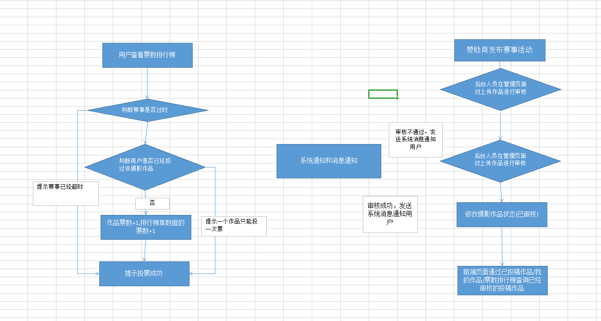

## 功能模块分析


1. 摄影记录 + 游记
  * |-- 每日推荐
  * |-- 游记和摄影的上传 + 发布
  * |-- 搜索模块
    * |-- 摄影作品 + 游记 + 摄影师
2. 在线课程，教育频道
   * |-- 摄影技巧分享，专业摄影技术，后期技术等培训
3. 智能修图
4. 全新赛事 + 活动应用 + 赛事投票
    * |--活动推广
5. 用户信息模块
    * |-- 分享，举报，黑名单
6. 附近
    * |-- 根据当前地区筛选摄影作品
7. 摄影作品的上传
    * |-- 选择分类 + 作品图片 + 作品标题
    * |-- 上传 --> 发布
    * |-- 存为草稿


## 功能分析
### 首页


首页导航功能主要展示：

1. 推荐（每日佳作）
  * |-- 显示每日推荐的摄影作品(后台根据当前日期发布的摄影作品筛选推荐数据)
  * |-- 摄影师的个人信息 + 摄影作品
    


2. 达人(关注摄影师)
  * |-- 显示推荐的摄影师：关注摄影师，可以在关注模块查看对应摄影师的摄影作品
  * |-- 在我的个人中心能查看关注数据

实现:
  * |- 后台查询推荐摄影师的数据
  * |-- 点击关注,根据uid查询关注列表,查看是否存在userId的数据
    * |-- 存在,在followIds添加摄影师id
    * |-- 不存在，在关注列表中创建记录,添加关注摄影师的id


3. 赛事模块(后面分析)
  * |-- 显示所有赛事活动, 由赞助商发布的
4. 活动(后面分析)
  * |-- 限时报名活动列表数据
  * |-- 我的活动模块
    * |-- 我发起的
    * |-- 我参加的
5. 修图模块(后面分析)
    |-- 修图模块需要访问web网页端,选择AI只能修图或是人工精修,移动端只显示网页连接信息

6. 排行榜模块
  * |-- 根据用户的摄影作品的点赞总数 按照 日榜/月榜/总榜 进行排序(只显示前15名)
  * |-- 日榜 : 查询摄影师所有的当天摄影作品的点赞数之和
      * |-- 使用redis zset实现topN排序，缓存点赞数,当用户当天摄影作品被点击时,摄影师对应的点赞数+1
  * |-- 月榜 ：查询摄影师当月所有摄影作品的点赞数之和
      * |-- 当用户当天摄影作品被点击时,摄影师对应的点赞数+1
  * |-- 总榜 : 查询摄影师所有作品的点赞数之和


7. 消息通知模块
  * |-- 评论通知(当用户的摄影作品被评论时，需要使用极光推送，推送消息)
  * |-- 系统通知(由后台管理人员通过极光推送平台推送给对应客户系统消息)


8. 搜索模块
  * |-- 根据相关地区关键字搜索摄影作品 + 游记 + 摄影师
6. 主页页面展示数据
  * |-- 推荐游记(分页显示)
  * |-- 摄影作品(分页显示:按照点赞数进行排序) ： 按照摄影分类进行筛选
  * |-- 最新摄影作品


8. 摄影作品详情页面 （mongodb + redis 统计数据）
  * |-- 显示相关摄影图片
  * |-- 评论(点赞) + 收藏 + 点赞 + 分享(个数)
  * 评论模块:
    * 使用mongodb记录评论信息和用户信息, type 用来区分是作品的评论还是评论的评论s
    * 评论点赞 : 使用点赞集合保存评论用户，判断用户是否点赞
    * 评论数: 保存redis中的评论数+1
  * 收藏模块:
    * 保存收藏数据（收藏列表）
    * 数据库中的摄影作品，收藏数+1
  * 点赞 :
    * 保存点赞数(点赞列表)
    * 数据库中的摄影作品，点赞数+1
    * 修改redis 中排行榜数据 :
       |-- 如果当前摄影是今天发布，日榜 ， 月榜 ，总榜 +1
  * 分享
    * 安卓端实现分享功能
    * 修改redis中分享数据


-----

9. 游记详情界面


## 附近页面
1. 显示相关地区的摄影作品数据,（根据前端传的经纬度计算）
2. 显示推荐游记数据(后端管理推荐游记列表,实现推荐功能)


## 游记+摄影作品发布
1. 游记发布
需求分析:
  * |-- 游记标题
  * |-- 游记目的地
  * |-- 游记经典的位置定点信息
  * |-- 游记图片 + 文字描述(生成预览效果)
    * |-- 更换模板北京图片 + 封面,生成html文本数据传送到后台进行审批处理
    * |-- 不发布数据，保存到草稿箱


```java
--游记实体类--
t_travel{
`id`
`dest_id`  //目的地
`author_id`  //作者id
`title`  //游记标题
`summary`  //游记摘要
`coverUrl`  //游记封面
`createTime`  //创建时间
`releaseTime` //发布时间
`isPublic`  //是否发布
`replynum`  //评论
`favornum`  //点赞
`sharenum` //分享
`thumbsupnum` //点赞数
`state`  //游记状态  :
}
---游记内容---
t_travelcontent{
  id,
  content
}


----游记推荐----
t_travel_conment{
  `id`
  `travel_id`
  `title`
  `subTitle`
  `coverUrl`
  `state`
  `sequence`
}

```

2. 摄影作品发布
  * |-- 作品的标题
  * |-- 设置作品的分类
  * |-- 添加作品的图片 + 位置定点
  * |-- 作品发布后需要进行审核,审核通过后，发布作品,通知用户审核通过


### 实体分析
**摄影作品**
```java
-- 摄影作品 --
t_photo{
  id,
  title, //作品标题
  photo_type,  // 摄影作品的分类类别
  t_photo_img,//摄影图片
  themeBg //主题背景
  replynum//评论数
  favornum// 收藏数
  thumbsupnum// 点赞数
  sharenum// 分享数
  publishTime//发布时间
  createTime// 创建时间
  authorId //作者的id
  status// 状态--> 审批/草稿/
}
t_photo_img{
  id,
  local,  // 地址名称
  longitude , //经度
  latitude, // 纬度
  content  //描述信息
}

-- 中间表保存摄影作品和分类信息 --
t_photo_type_relation{
  type_id,
  photo_id
}


--摄影推荐--
t_photo_recommend{
  `id`
  `photo_id` //推荐照片
  `title`  
  `subTitle`
  `coverUrl`
  `state`
  `sequence`
   authorId  // 推荐作者id
}

-- 摄影分类 --
t_photo_type{
  id,
  title,
  logo
}
```

## 关注模块
1. 显示用户关注的摄影师的摄影作品,可以按照摄影分类进行数据筛选
2. 显示关注的其他用户的游记数据
2. 尚未关注用户时显示系统推荐的游记数据和摄影数据

业务逻辑分析:
1. 在关注列表中查询是否有userId记录
  * |-- 有，查询关联的follweIds关注的摄影师的ids
    * |--根据关注用户的ids查询相关的摄影作品和游记数据(时间为当前时间)
  * |-- 没有查询系统推荐的游记数据和摄影数据
    * |-- 查询推荐列表关联的推荐游记庶几乎+推荐摄影数据

  


## 个人中心模块
#### 需求分析:
1. 显示用户个人信息数据 : 关注 + 粉丝 + 获赞 + 昵称 + 签名
2. 用户相关的 摄影作品 + 游记 + 收藏数据

  


## 赛事模块
显示所有赛事活动, 由赞助商发布的摄影作品投票活动,用户可以通过投稿个人作品，在投票中获得票数较高的获得赞助商提供的相关奖品




```
--- 赛事实体 ---
t_match{
  id,
  match_title, // 赛事标题
  status, // 赛事状态   投稿中/已截稿
  publishTime，  //发布时间
  endTime ,  // 截至时间
  t_match_content,   //投稿介绍
  t_contribute[]  //投稿作品数据
}
t_match_content{
  id,content   
}

--投稿作品--
t_contribute{
  id,
  imgs,  //投稿作品
  authorId,  //投稿用户
  title,  //投稿名称
  content, //投稿内容
  realName, //真实姓名
  linkPhone  //联系方式
  ticket  // 票数
  createTime  //投稿时间
  publishTime  // 发布时间
  status // 待审核/审核通过
}
```

### 赛事详情页面
#### 需求分析:
1. 显示赛事的相关介绍
2. 显示已经投稿的摄影作品和我的作品
3. 票数排行榜页面按照投票数显示前十名作品数据
4. 投票功能
  * 限制用户一天只能投一次票,需要验证用户的登陆token
  * 防止用户刷票 ：使用接口防刷限流
  * 多请求处理票数时，使用mq队列处理投票请求,投票成功后


#### 业务实现:
1. 赛事发布 : 后台管理页面发布赛事相关活动
2. 摄影师投稿 :
  * 用户通过上传摄影作品+联系方式+真实姓名+作品描述到后台管理
  * 用户投稿后由后台管理页面进行审核,审核通过通过消息推送发送系统通知通知用户
3. 用户作品审核通过后，在已投稿作品，和我的作品中可以查询已经审核通过的作品(按照发布时间进行排序)
4. 赛事投票功能 : (高并发场景)
  * 验证用户是否登陆
  * 使用redis list 记录用户投票信息，如果用户已经投票,提示用户已经投过了
    * |-- key: xxx:活动id:作品id
    * |-- value : uid1,uid2
  * 使用MQ 消息队列做削峰处理，处理多个投票请求,异步处理请求信息,修改数据库投票数
    * |-- 投票成功后,添加将用户id添加到redis中,设置过期时间为 1天
    * |-- 修改投票排行榜数据,对应作品的积分store +1
  * 使用redis zset 保存投票数据,实现票数排行榜
    * |-- key:xxx:活动id:作品id
    * |-- value : json(投稿信息)
    * |-- store : 票数
  * 隐藏投票地址 + 验证码 + 接口防刷：同一个ip 不能同时访问同一个接口多次

#### 赛事页面


   


## 活动

#### 需求分析:
1. 用户通过发布摄影活动
2. 发布活动时需要限制活动的认数 + 行程(时间) + 出发地和目的地 +报名者需要提供的信息 + 集合地点的设置
3. 用户报名活动时后需要填写个人报名信息,需要退团时需要提前一天取消订单
  * 如果是免费活动时，会有高并发业务场景，需要进行处理
  * 用户下单后,生成订单数据,通知用户报名成功
  * 多个请求访问活动数据,需要限制用户是否已经参加过这个活动
  * 活动过期时不能参加
  * 判断活动限制人数是否足够

#### 业务逻辑实现分析
1. 创建活动 : 用户创建活动后，由后台人员进行审核，审核通过后结果通知用户
2. 参加活动（高并发场景）
  * 判断用户是否登陆
  * 判断活动的时间是否过期
  * 判断用户是否已经参加过这个活动
    * |-- 定义一个t_seckill_order,防止重复下单,针对一场的限时活动，一个用户只能参加一次（使用redis做数据缓存）
  * 判断活动限制人数是否足够
    * |-- 使用redis 做原子性递增,判断活动当前人数是否大于限制个数(并发环境下)
  * 使用MQ 消息队列做削峰处理，异步处理多个订单请求
    * |-- 在订单队列监听中处理订单请求,下单成功后，发送系统通知用户
    * |-- 下单失败，需要进行活动名额回补
  * 防止超卖问题 ： 需要在下单时使用乐观锁 where currentCount&lt;countLimit -->当前参加人数<人数限制

优化:
* 控制下单人数优化:
  * 利用redis的原子性控制下单人数，redis 是单线程不会存在并发问题
  * |-- 初始化时，保存所有订单数据的预库存数据到redis中（string类型）
  * |-- 每次下单时，decr操作减去redis中的库存
  * |-- 库存预热在发布活动时进行初始化
* 防止用户重复点击--> 实现防刷限流


### 活动页面

活动列表--活动详情
 

创建互动--基本信息


#### 实体分析

```
----活动----
t_action{
  id
  coverUrl // 活动封面
  type  // 活动类型 ： 采风/自驾/户外
  payType //活动费用 : AA/免费/商业
  countLimit  //人数限制--> 限定多少人可以参加
  currentCount // 当前报名的人数
  status  // 审核通过/待审核/拒绝

  ---基本信息
  theme   //活动主题
  startTime  //活动开始时间+结束时间
  endTime
  origin  //出发地
  destination  //目的地

  ---集合地点设置--
  local,  // 地址名称
  longitude , //经度
  latitude, // 纬度
  assembleTime   // 集合时间
  ---

  --活动说明--
  actionContent   // 活动说明html
}
-- 活动详情信息---
actionContent{
  id,content
}

---活动订单---
t_action_order{
  `order_no` // 订单编号--> 使用雪花算法
  `action_id`   // 活动的id
  `action_cover_Url` //活动的封面
  `status`  //订单状态 : 未支付/已支付/超时取消/手动取消
  `create_date` //创建时间
}

-- 用户判断用户是否参加过这个活动--
t_seckill_order` {
  `id`
  `user_id` //用户的id
  `order_no`  //订单的编号
  `seckill_action_id` //订单
}

```


### 摄影师实体
```java
//----用户数据---
t_userInfo{
  `id`
  `nickname`  
  `phone`  
  `email`  
  `password`
  sex
  `level`
  `city`  
  `birthday
  `headImgUrl`  
  `info`
  `state`
  isRecommend  // 是否推荐
  thumbsupTotalNum  // 总体的点赞数
  fansNum // 粉丝的数量
}

-- 关注列表 --
t_follow{
  id,
  userId, // 用户id
  followIds, // 用户关注的id (json数据保存)
  fansIds //用户的粉丝id （json数据保存）
}


```

### 评论列表
```java
class PhotoComment implements Serializable {
   public static final int PHOTO_COMMENT_TYPE_COMMENT = 0; //普通评论
   public static final int PHOTO_COMMENT_TYPE = 1; //评论的评论
   //----------前端传递数据---------
   @Id
   private String id;  //id
   private Long photoId;  //游记id
   private String photoTitle; //游记标题
   private String content;  //评论内容
   private int type = PHOTO_COMMENT_TYPE_COMMENT; //评论类别

   //-----------后端设置数据---------
   private Long userId;    //用户id
   private String username; //用户名
   private String headUrl;   // 用户头像
   private String city;
   private int level;

   private Date createTime; //创建时间
   private photoComment refComment;  //关联的评论

   private int thumbupnum;     //点赞数
   private List<Long> thumbuplist = new ArrayList<>(); //保存评论点赞人的id

}
```


### 收藏列表
记录收藏的数据,用于查询用户收藏数据
```
t_favor{
  id,
  actionTime,
  userId,  // 收藏用户的id
  type,  // 收藏游记/摄影作品
  targetId  // 游记的id /摄影的id
}
```


## 修图

#### 需求分析:
1. 修图模块需要访问web网页端,选择AI只能修图或是人工精修,移动端只显示网页连接信息
2. 网页端首页显示修图技师的页面，按照销量 | 评价 | 价格进行排序
3. 用户选择修图技师,需要通过添加需要修的图片和需求描述,提交订单
  * |-- 如果用户积分不足，需要用户充值积分
4. 下单成功后,扣除用户账户上对应的积分，设置订单状态为已支付
  * |-- 当订单状态为已完成状态时，才将积分数据转发给修图技师


## 微服务服务构建
```
消息通知服务
活动服务
赛事服务
会员服务
redis 缓存服务
搜索服务
游记和摄影应用服务

后台管理项目
移动端接口应用
```
