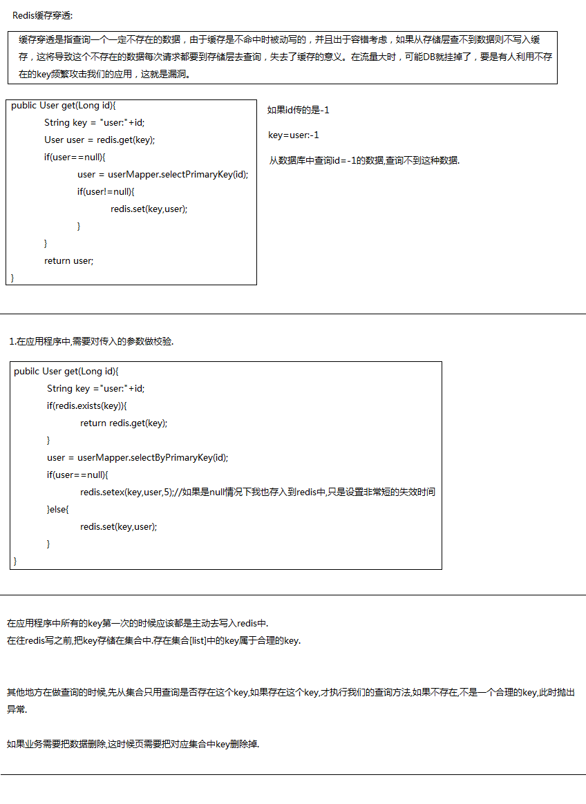

### Redis 的缓存穿透
缓存穿透是指查询一个一定不存在的数据，由于缓存是不命中时被动写的，并且出于容错考虑，如果从存储层查不到数据则不写入缓存，这将导致这个不存在的数据每次请求都要到存储层去查询，失去了缓存的意义。在流量大时，可能DB就挂掉了，要是有人利用不存在的key频繁攻击我们的应用，这就是漏洞。

```java
public User get(Long id){
  String key="user:"+id;
  User user=redis.get(key);
  if(user==null){
    user=UserMapper.selectPrimaryKey(id);
    if(user!=null){
      redis.set(key,user);
    }
  }
  return user;
}
分析：
1. 如果id 传的是-1,key=user:-1
2. 每次从数据库中查询id=-1的数据，查询不到这种数据
3. 所有的请求都会直接到数据库中，就会导致redis缓存没有意义，会导致缓存穿透
```

解决方案:
1. 在应用程序中，需要对传入的参数做校验
  * 防止同一个key多次进行查询

```java
public User get(Long id){
  String key="user:"+id;
  if(redis.exits(key)){
      return redis.get(key);
  }
  User user=UserMapper.selectPrimaryKey(id);
  if(user==null){
    redis.setex(key,user,5);//如果是null情况下也存入redis中，只是设置非常短的失效时间
  }else{
    redis.set(key,user);
  }
  return user;
}
```

2. 在应用程序中所有的key 第一次的时候应该都是主动去写入redis中(预热数据)
  * 在往redis写之前，把key 存储在集合中,存在集合中的key都属于合理的key
  * 其他地方在做查询的时候，先从集合只查询是否存在这个key,才执行查询方法，不是一个合理的key，此时抛出异常
  * 如果业务需要把数据删除，这时候也需要把对应集合中的key删除掉


<br>
---


