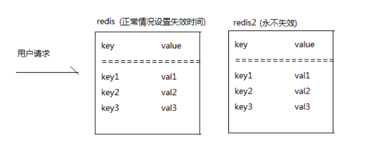

## Redis雪崩
在高并发的情况下，redis中大量的key同时失效了，此时大量的请求落在MYSQL数据库中，导致数据库被拖垮了

#### 方案一 : 随机失效时间
  * 尽量在设置redis的key 失效时间的时候加入随机数, 尽量让redis的key分散一点

```
key       value       设置时间      有效时长
---------------------------------------------
key1      val1        15:18         10
key2      val2        15:20         8
key3      val3        15:25         3
```

这种情况下，这三个key也会同时失效


#### 方案二:双缓存
缓存1: 正常情况设置失效时间
缓存2: 永不失效



用户请求，发现redis服务器中此时失效了，而是从redis2把数据返回,往MQ发送一个消息，然后排队处理，查询数据库中对应的key的数据，然后再更新redis1和redis2的数据


#### 方案三:
1. 监听redis2 的key失效时间,可以获取到失效的key字符串,通过截取的方式，可以获取到key1,key2,key3 字符串，把这些信息放入到MQ中,顺序的去redis中删除对应的key
2. 多个请求去访问同一个key时，使用分布式锁


<br>
<hr>


