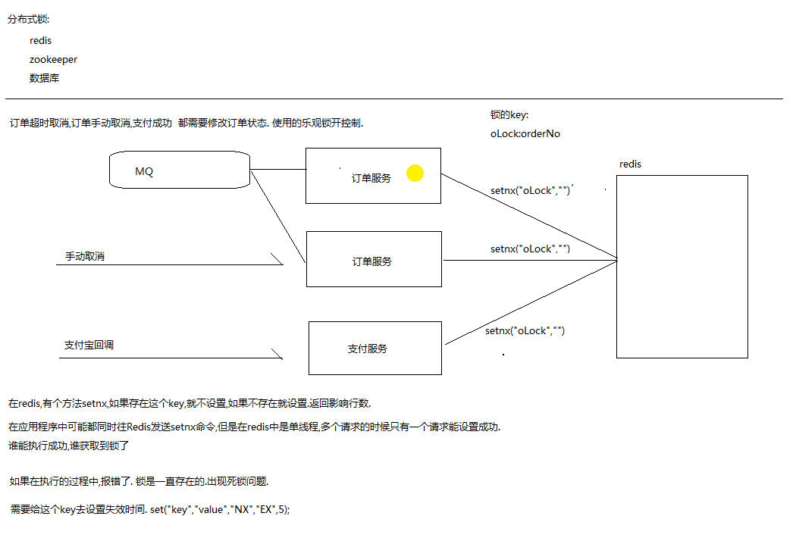
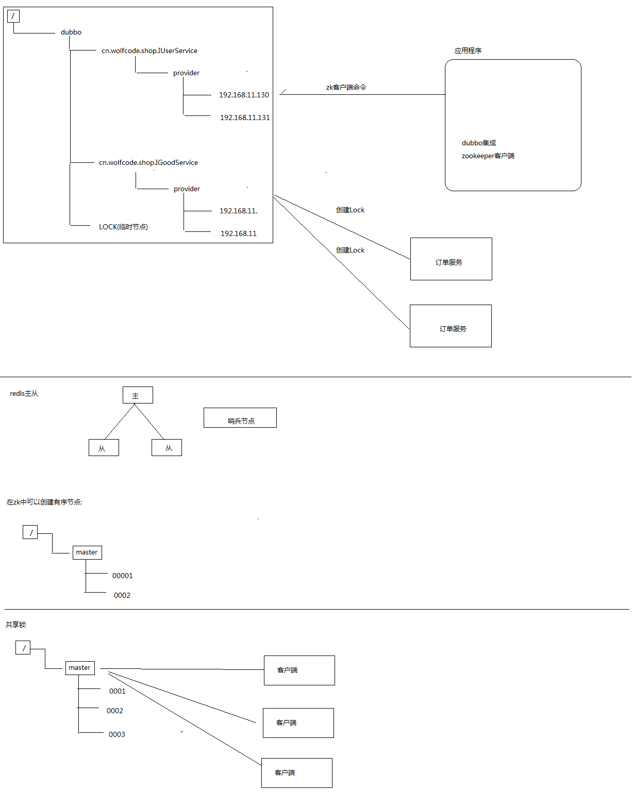

## 分布式锁
实现方式 :
* 基于redis 的分布式锁
* 基于zookeeper 的分布式锁
* 数据库乐观锁

参考网站 : https://www.cnblogs.com/orzlin/p/9604488.html
https://wudashan.cn/2017/10/23/Redis-Distributed-Lock-Implement/
### 数据库乐观锁

* 订单超时取消，订单手动取消，支付成功，同一时间都需要修改订单状态，使用乐观锁来控制,只有一个能成功
* 如果有3000个请求，只有1000个请求能成功,2000会报错

* synchronized : 只能在单个jvm中能生效,只能锁单个服务中的多个线程

### redis分布式锁实现

#### 实现分析
* 在redis 中 **setnx** 如果存在这个key,就不设置，如果不存在就设置，返回受影响行数

* 在应用程序中可能都同时往Redis 发送setnx命令，但是在redis是单线程，多个请求的时候只有一个请求能设置成功，谁能执行成功，谁获取到锁了

#### 锁的key 设计

onLock:orderNO -->  前缀+订单号，只有同一个订单才会加锁

#### 死锁问题
问题 : 如果在执行的过程中，报错了，锁是一直存在的，会出现死锁的问题
* 需要给这个key 去设置失效时间(setex)
* 使用jedis 多参数设置方法 : set(key,value,"NX","EX",5);// 设置NX,EX同时生效(原子性操作)

## zookeeper 实现分布式锁
1. 客户端发送zk客户端命令给zookeeper创建相关的服务节点，但不能创建相同的节点
2. 通过创建一个临时节点,只会在客户端连接的时候节点还在，客户端关闭，节点会删除

#### zookeeper 实现选举
zookeeper 中可以创建有序的节点
zookeeper实现共享锁(都可以获得锁，按照顺序执行，但同一时间只有一个能成功):
多个客户端去创建节点,会按照顺序去删除

